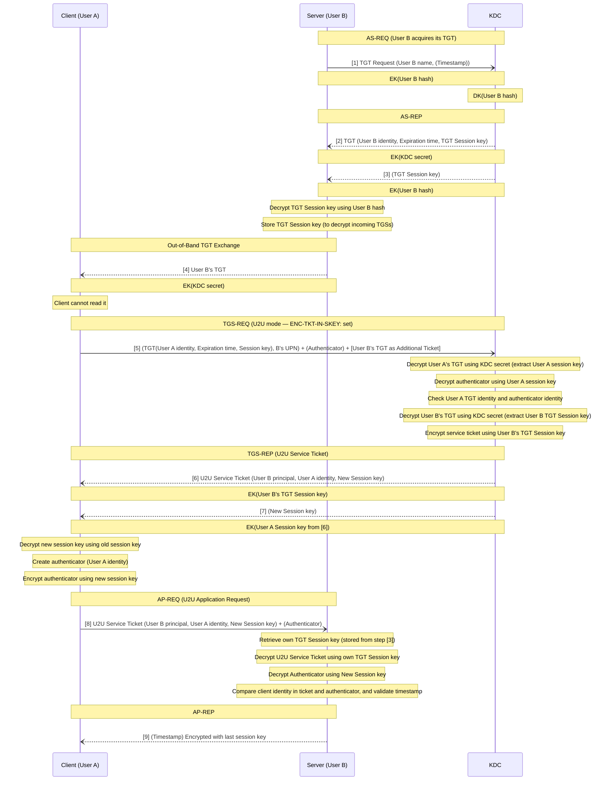

### Content

- [Overview](#overview)
- [Unconstrained Delegation](#unconstrained-delegation)
- [Constrained Delegation](#constrained-delegation)
- [Resource Based Constrained Delegation](#resource-based-constrained-delegation)
- [S4U (Service For User)](#s4u-(service-for-user))
	- [S4U2Self (Service for User to Self)](#s4u2self-(service-for-user-to-self))
	- [S4U2Proxy (Service for User to Proxy)](#s4u2proxy-(service-for-user-to-proxy))
	- [U2U (User to User)](#u2u-(user-to-user))

> [Great Reference which also have other great references](https://en.hackndo.com/constrained-unconstrained-delegation/#constrained--unconstrained-delegation)

---
### Overview

Because of how Kerberos tickets work, servers have no means of forwarding client credentials to other resources, as they only have the service ticket encrypted with their own password. This is known as the **Kerberos Double-Hop Problem.**

To solve this, Microsoft introduced Delegation, a feature that allows servers to forward client credentials to another service, enabling the second service to authenticate the client on behalf of the first server. Today, there are three forms of Kerberos delegation:

- **Unconstrained Delegation:** Unconstrained was the first form of delegation. When a client authenticates to a server configured with unconstrained delegation, the client will also pass their TGT alongside their TGS allowing the destination to reuse the TGT to authenticate as that user to the next resource.
- **Constrained Delegation:** Unconstrained delegation had major security implications, and to mitigate the risks associated with compromising a host configured with this form of delegation, constrained delegation restricts the ability to delegate to a specified Service Principal Name (SPN) on a specified destination. This form of delegation also introduced two proxies to eliminate TGT forwarding: S4U2Self and S4U2Proxy.
- **Resource-Based Constrained Delegation:** Resource-based constrained delegation is very similar to constrained delegation, with the primary difference being that the destination (resource) determines what services can delegate to it.


---
### Unconstrained Delegation

- Kerberos unconstrained delegation enables a service or a computer to impersonate a user to every other service.
- Unrestricted kerberos delegation is a privilege that can be assigned to a domain computer or a user.
- If a user is marked as `Account is sensitive and cannot be delegated` in AD, no other object will have the ability to impersonate them.


The server or the service account can authenticate on behalf of the user to any other services. For this to be possible, two prerequisites are required:

- The first one is that the account that wants to delegate an authentication has the `TRUSTED_FOR_DELEGATION` flag in his [UAC - User Account Control](https://docs.microsoft.com/en-us/windows/win32/adschema/a-useraccountcontrol?redirectedfrom=MSDN) flags.
	- In order to set this flag, you need to have the `SeEnableDelegationPrivilege` right, which is usually only available for domain administrators. Here is how the flag is set on the account (machine or service account):


- The second one is that the user account which will be relayed is effectively “relayable”.
	- To **disable** relaying capabilities on an account, [NOT_DELEGATED](https://docs.microsoft.com/en-us/windows/desktop/api/iads/ne-iads-ads_user_flag) flag is set.
	- By default, no account on the AD has this flag set, so they are all “relayable”.

When the user asks for a TGS, he will specify the [SPN](https://en.hackndo.com/service-principal-name-spn) of the service he wants to use. It is at this point that the Domain Controller will look for the two prerequisites :

- Is the `TRUSTED_FOR_DELEGATION` flag set in the attributes of the account associated to the [SPN](https://en.hackndo.com/service-principal-name-spn).
- Is the `NOT_DELEGATED` flag **not** set for the requesting user.

If both prerequisites are met, then the Domain Controller will respond to the user with a [KRB_TGS_REP](https://en.hackndo.com/kerberos/#krb_tgs_rep) containing standard information, but it will also contains a **copy of the user’s TGT** in his response, and a new associated session key.


---
### Constrained Delegation

`Constrained delegation` was first introduced with Windows Server 2003 and it was intended to restrict the services that a server can impersonate a user for, giving administrators the ability to specify application trust boundaries.


Server or Service (A) has constrained delegation set. **Server or Service (A)** wants to access **Server or Service (B)** on behalf of **Server or Service or User (C)**:

(C) makes a TGS request, then sends it to (A) to access its resources. Since (A) needs to access resource (B) on behalf of (C), (A) will request a TGS to (B) from the DC on behalf of (C). This request is governed by a kerberos extension called [S4U2Proxy (Service for User to Proxy)](#s4u2proxy-(service-for-user-to-proxy)) . To tell the DC it wants to authenticate on behalf of (C), (A) will send a special (TGS) request to the DC. The special TGS request contains two modified fields compared to a classic TGS request:

- The `additional tickets`, usually empty, contains a copy of the TGS that (C) sent to server (A). 
	- Given that the `NOT_DELEGATED` flag is **not** set for (C). (If that was the case, (C)'s TGS would **not** be `forwardable`, and the Domain Controller would not accept it in the rest of the process)
- The `cname-in-addl-tkt` flag will be set to indicate to the DC that it should not use (A) information but use (C) ticket information in `additional tickets`.

It is during this request that the DC, upon seeing this information, will verify that (A) has the right to authenticate to (B) on behalf of (C).

The list of services allowed for delegation is stored in the `msDS-AllowedToDelegateTo` attribute of the service account in charge of the delegation (A).


If the targeted SPN, which refer to resource (B), is present, then the DC sends back a valid TGS, with the name of the user (C), for the requested service (B). 


---
### Resource Based Constrained Delegation

- Resource-Based constrained delegation shifts the delegation management to the final resource.
- A trust list is created on the resource, Any account on this trusted list has the right to delegate authentication to access the resource.
- Unlike the other two types of delegation, the resource has the right to modify its own trusted list.
- If a service account adds one or more accounts to its trusted list, it updates its `msDS-AllowedToActOnBehalfOfOtherIdentity` attribute in the directory.

The same as the [Constrained Delegation](#constrained-delegation), but this time, the DC will look at the attributes of Machine/User account that's hosting the service (B) (instead of Service A attributes). It will check that the account associated with Service (A) is present in the `msDS-AllowedToActOnBehalfOfOtherIdentity` attribute of the account linked to Resource B.

Adding a computer to the trusted list:

```PowerShell
PS C:\Tools> Import-Module ActiveDirectory
PS C:\Tools> Set-ADComputer DBSRV -PrincipalsAllowedToDelegateToAccount (Get-ADComputer WEBSRV)
```


Then, when a service wants to access a resource, here’s how it works:


---
### S4U (Service For User)

> [!Important]
> 
> if a user (C) did authenticate to (A) in other ways than the Kerberos (e.g. via NTLM, or even a Web form), (A) is not in possession of the TGS sent by the user. Thus, (A) cannot fill the `additional-tickets` field as it did in the case described above.
> 
> That is why there is an extra step, possible through the [S4U2Self (Service for User to Self)](#s4u2self-(service-for-user-to-self)) extension, that (A) must perform. This step allows it to obtain a TGS for a user **arbitrarily chosen**. To do this, it makes a classic TGS request except that instead of putting his own name in the `PA-FOR-USER` block (present in the pre-authentication part), it puts the name of a user **it chooses**.

This ability to manage **protocol transition** is accepted by the DC only if it has been explicitly granted to the service account wishing to manage this delegation. It is in delegation management tab that an administrator can choose a constrained delegation using Kerberos only or using any protocol.


In the first case, no specific flag is set on the account, and the service can only relay kerberos authentication. It cannot use the S4U2Self extension to create a ticket out of nowhere.

In the second case, the **TRUSTED_TO_AUTHENTICATE_FOR_DELEGATION** flag is set. If this is the case, then the service with this flag **can pretend to be anyone** when accessing services in its list via the **S4U2Self** extension.

After abusing [S4U2Self (Service for User to Self)](#s4u2self-(service-for-user-to-self)), the another [S4U2Proxy (Service for User to Proxy)](#s4u2proxy-(service-for-user-to-proxy)) kerberos extension comes into play, once a service has a TGS for a user (from S4U2Self), it can use S4U2Proxy to request additional TGS on behalf of that user to access other services that are listed on the delegated service's list of permittable SPNs.


#### S4U2Self (Service for User to Self)

- This part of the delegation allows a service (like a web server or computer account) to request a Kerberos service ticket to access itself on behalf of a user.
- In this step, the service says: "I am acting as user X (e.g., a domain admin or any other user)."
- Importantly, the service doesn't need the user's password. Instead, it uses its own credentials (like the machine account's credentials or the service account's credentials) to ask the (KDC) for a ticket that represents the user.
- Once the service receives this ticket, it can use it to interact with other resources as if it were the user.

#### S4U2Proxy (Service for User to Proxy)

- This is the next step after S4U2Self. Once a service has a ticket for a user (from S4U2Self), it can use S4U2Proxy to request additional tickets on behalf of that user to access other services.
- For example, if a web server acting as a user needs to access a file server, it uses the S4U2Proxy request to ask the KDC for a ticket to access the file server, acting on behalf of the user.
- This allows the service to act as the user when interacting with other systems, enabling privilege escalation or lateral movement within the network, depending on the user's access rights.

#### U2U (User to User)

Remember what you read in the start if the S4U part? 

> if a user (C) did authenticate to (A) in other ways than the Kerberos (e.g. via NTLM, or even a Web form), (A) is not in possession of the TGS sent by the user. Thus, (A) cannot fill the `additional-tickets` field as it did in the case described above.

What if (A) account doesn't have a SPN at all?
What if (A) account is just a user account that is hosting a peer-to-peer application that normal users can log in into it?

In the standard case: When a user requests a service ticket from the KDC by supplying their TGT and the requested SPN, the KDC will search Active Directory for the account associated with that SPN, retrieve its long-term key, and use it to create and encrypt the service ticket.

In the U2U case: When a user requests a service ticket from the KDC by supplying their TGT and specifying a target principal, while also including the target user's TGT as an additional ticket and setting the `ENC-TKT-IN-SKEY` flag.

> The `ENC-TKT-IN-SKEY` flag is a specific option in the Kerberos TGS-REQ that tells the KDC to switch from the normal ticket encryption model to the User-to-User (U2U) model.

##### The U2U Solution

> **Instead of encrypting the service ticket with the service's long-term key, encrypt it with the session key from the service's own TGT.**

Overview:

1. A request is sent to the DC requesting a TGS for client A to communicate with user `B@domain.local`, the request will include user B's TGT.
2. The KDC decrypts B's TGT and extracts its session key.
3. The KDC constructs a TGS for A to communicate with B, which will be encrypted using the TGT session key from above.
###### U2U Authentication Flow


