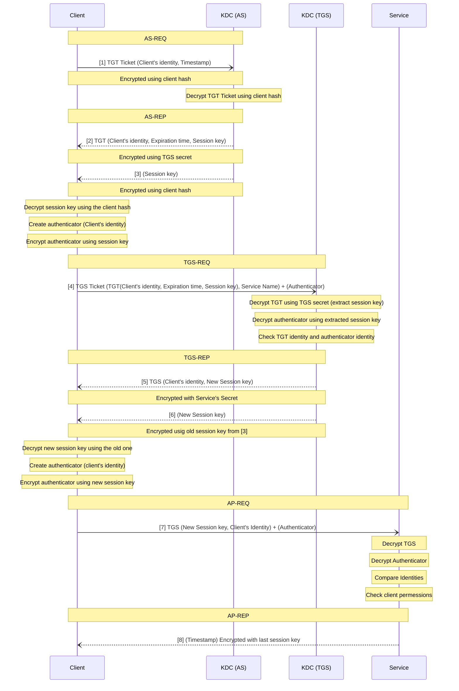
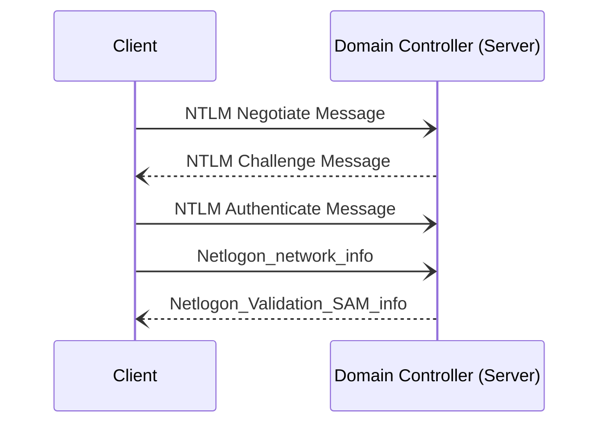
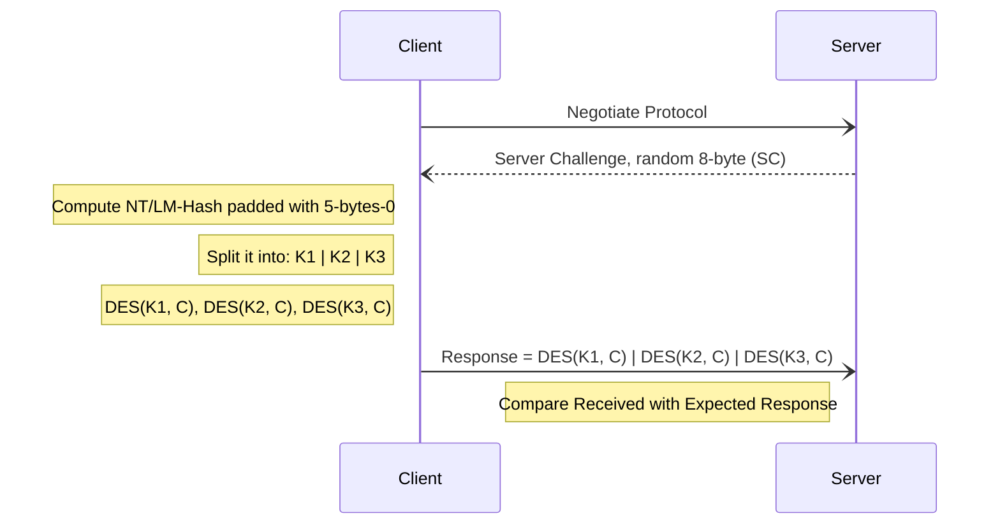
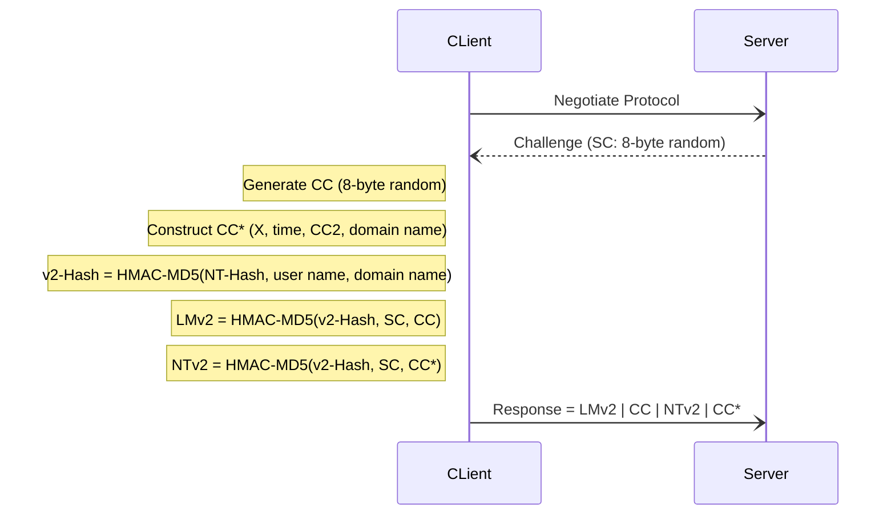

### Content
- [Kerberos](#kerberos)
- [LDAP](#ldap)
- [MSRPC](#msrpc)
- [Authentication Methods](#authentication-methods)
	- [LM](#lm)
	- [NT Hash (NTLM)](#nt-hash-(ntlm))
	- [NTLMv1 (Net-NTLMv1)](#ntlmv1-(net-ntlmv1))
	- [NTLMv2 (Net-NTLMv2)](#ntlmv2-(net-ntlmv2))
---
# Kerberos
Network-based authentication protocol that uses secret-key cryptography to verify the identity of users and services.
All actors have to synchronize the time between them.
The Kerberos protocol uses **port 88 (both TCP and UDP).**
##### Components in Kerberos:
1. **Key Distribution Center (KDC)**:
	1. Central authority that manages authentication.
	2. Have two sub-components:
		1. **Authentication Server (AS)**: Handles initial authentication requests.
		2. **Ticket Granting Server (TGS)**: Issues service tickets for accessing resources.
2. **Client**: The user or application requesting authentication.
3. **Service**: The resource or application the client wants to access.
4. **Tickets**:
	1. **Ticket Granting Ticket (TGT)**: Proof of authentication, used to request service tickets.
	2. **Ticket Granting Service (TGS)**: Allows access to a specific service.
5. **Session Key**: Temporary key used to encrypt communication between two parties during a session.


---
# LDAP
- LDAP is how systems in the network environment can "speak" to AD.
- LDAP uses port 389, and LDAP over SSL (LDAPS) communicates over port 636.
- The relationship between AD and LDAP can be compared to Apache and HTTP.
- LDAP authentication messages are sent in cleartext by default.
#### AD LDAP Authentication Types
1. `Simple Authentication` Includes:
	1. `Anonymous Authentication`: No credentials are supplied.
	2. `Unauthenticated Authentication`: A username is provided, but no password is required. 
	3. `Username/Password Authentication`: A BIND request with a username and password.
2. `SASL Authentication`: [The Simple Authentication and Security Layer (SASL)](https://en.wikipedia.org/wiki/Simple_Authentication_and_Security_Layer) uses other authentication services, such as Kerberos.


<div style="display: flex; justify-content: center;"></div>

---
## MSRPC

MSRPC is Microsoft's implementation of Remote Procedure Call (RPC), an interprocess communication technique used for client-server model-based applications.
Windows systems use MSRPC to access systems in Active Directory using four key RPC interfaces:

|Interface Name|Description|
|---|---|
|`lsarpc`|A set of RPC calls to the [Local Security Authority (LSA)](https://networkencyclopedia.com/local-security-authority-lsa/) system which manages the local security policy on a computer, controls the audit policy, and provides interactive authentication services. LSARPC is used to perform management on domain security policies.|
|`netlogon`|Netlogon is a Windows process used to authenticate users and other services in the domain environment. It is a service that continuously runs in the background.|
|`samr`|Remote SAM (samr) provides management functionality for the domain account database, storing information about users and groups. IT administrators use the protocol to manage users, groups, and computers by enabling admins to create, read, update, and delete information about security principles. Attackers (and pentesters) can use the samr protocol to perform reconnaissance about the internal domain using tools such as [BloodHound](https://github.com/BloodHoundAD/) to visually map out the AD network and create "attack paths" to illustrate visually how administrative access or full domain compromise could be achieved. Organizations can [protect](https://stealthbits.com/blog/making-internal-reconnaissance-harder-using-netcease-and-samri1o/) against this type of reconnaissance by changing a Windows registry key to only allow administrators to perform remote SAM queries since, by default, all authenticated domain users can make these queries to gather a considerable amount of information about the AD domain.|
|`drsuapi`|drsuapi is the Microsoft API that implements the Directory Replication Service (DRS) Remote Protocol which is used to perform replication-related tasks across Domain Controllers in a multi-DC environment. Attackers can utilize drsuapi to [create a copy of the Active Directory domain database](https://attack.mitre.org/techniques/T1003/003/) (NTDS.dit) file to retrieve password hashes for all accounts in the domain, which can then be used to perform Pass-the-Hash attacks to access more systems or cracked offline using a tool such as Hashcat to obtain the cleartext password to log in to systems using remote management protocols such as Remote Desktop (RDP) and WinRM.

---
# Authentication Methods
- `LM` and `NTLM` here are the hash names.
- `NTLMv1` and `NTLMv2` are authentication protocols that utilize the `LM` or `NT` hash.

| **Hash/<br>Protocol** | **Cryptographic technique**                          | **Mutual Authentication** | **Message Type**                | **Trusted Third Party**                         |
| --------------------- | ---------------------------------------------------- | ------------------------- | ------------------------------- | ----------------------------------------------- |
| `NTLM`                | Symmetric key cryptography                           | No                        | Random number                   | Domain Controller                               |
| `NTLMv1`              | Symmetric key cryptography                           | No                        | MD4 hash, random number         | Domain Controller                               |
| `NTLMv2`              | Symmetric key cryptography                           | No                        | MD4 hash, random number         | Domain Controller                               |
| `Kerberos`            | Symmetric key cryptography & asymmetric cryptography | Yes                       | Encrypted ticket using DES, MD5 | Domain Controller/Key Distribution Center (KDC) |
### LM
- Old and weak.
- LAN Manager hashes are stored in:
	- SAM database on windows hosts.
	- NTDS.DIT on a Domain Controller.
- Passwords using LM are:
	- Limited to 14 chars
	- Not case sensitive because they are converted to uppercase before generating the hashed value.
- The algorithm:
	- If the password is less than 14 chars, padded with NULL chars to reach 14 chars.
	- Split the 14 chars into 2 chunks.
	- 2 DES keys are created from each chunk.
	- Encrypt the string `KGS!@#$%` twice, each with a key, which will create two 8-byte ciphertexts.
	- Concatenate the 2 ciphertexts resulting in an LM hash.
### NT Hash (NTLM)
- NT LAN Manager hashes are stronger.
- It's challenge-response authentication protocol.
- The protocol has two hashed password values to choose from to perform authentication:
	- LM hash
	- NT hash, which is the MD4 hash of the little-endian UTF-16 value of the password. `MD4(UTF-16-LE(password))`
- NTLM is vulnerable to pass the hash `PtH` attack
	- An NTLM hash looks like this: `<UserName>:<RelativeIdentifier(RID)>:<LM hash>:<NT hash>:::`
	- Use [CrackMapExec](https://github.com/byt3bl33d3r/CrackMapExec) to exploit PtH vuln:
		``` bash
		crackmapexec smb <IP> -u <UserName> -H <NT hash>
		```

### NTLMv1 (Net-NTLMv1)
- NTLMv1 uses both the NT and the LM hash.
- Attacker can capture the hash using a tool such as [Responder](https://github.com/lgandx/Responder) or via an [NTLM relay attack](https://byt3bl33d3r.github.io/practical-guide-to-ntlm-relaying-in-2017-aka-getting-a-foothold-in-under-5-minutes.html).
- The protocol is used for network authentication, and the Net-NTLMv1 hash is created from a challenge/response algorithm.
- Example `<UserName>::<DomainName(or)HostName>:<ServerChallenge>:<NTLMv1 Response>:<ClientChallenge>`

### NTLMv2 (Net-NTLMv2)
- Created as a stronger alternative to NTLMv1.
- Example `<UserName>::<Domain(or)HostName>:<SC>:<LMv2>:<NTv2>`

---