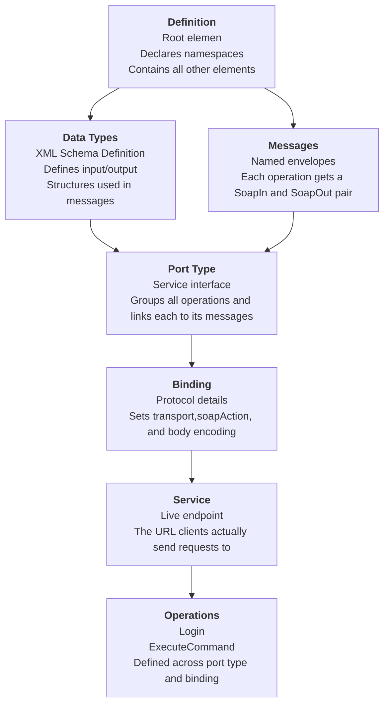

### Content

- [Web Service vs. API](#web-service-vs.-api)
- [Web Service Technologies](#web-service-technologies)
	- [XML-RPC](#xml-rpc)
	- [JSON-RPC](#json-rpc)
- [Web Services Description Language (WSDL)](#web-services-description-language-(wsdl))
	- [WSDL File Breakdown](#wsdl-file-breakdown)
		- [Definition](#definition)
		- [Data Types](#data-types)
		- [Messages](#messages)
		- [Port Type (Operations)](#port-type-(operations))
		- [Binding](#binding)
		- [Service](#service)

---
### Web Service vs. API

- Web services are a type of application programming interface (API).
	- The opposite is not always true!
- Web services need a network to achieve their objective.
	- APIs can achieve their goal even offline.
- Web services rarely allow external developer access.
	- Lots of APIs allow external developer access.
- Web services usually utilize SOAP for security reasons.
	- APIs can use different designs, such as `XML-RPC`, `JSON-RPC`, `SOAP`, and `REST`.
- Web services usually utilize the XML format for data encoding.
	- APIs may use different formats to store data, with the most popular being JSON format.

---
### Web Service Technologies

##### XML-RPC

[XML-RPC](http://xmlrpc.com/spec.md) is a Remote Procedure Calling protocol that works over the Internet.

- An XML-RPC message is an HTTP-POST request.
- The body of the request is in XML.
- A procedure executes on the server and the value it returns is also formatted in XML.
- Parameters can be scalars, numbers, strings, dates, complex record, list structures, etc.

Request example:

```HTTP
POST /RPC2 HTTP/1.0
User-Agent: Frontier/5.1.2 (WinNT)
Host: betty.userland.com
Content-Type: text/xml
Content-length: 181

<?xml version="1.0"?>
<methodCall>
    <methodName>examples.getStateName</methodName>
    <params>
        <param>
            <value><i4>41</i4></value>
		</param>
	</params>
</methodCall>
```

The payload is a `<methodCall>` structure that contains a sub-items, `<methodName>` to identify which method to be called and `<params>` to  start specifying the parameters to pass for the method.

Response:

```http
HTTP/1.1 200 OK
Connection: close
Content-Length: 158
Content-Type: text/xml
Date: Fri, 17 Jul 1998 19:55:08 GMT
Server: UserLand Frontier/5.1.2-WinNT

<?xml version="1.0"?>
<methodResponse>
    <params>
        <param>
            <value><string>South Dakota</string></value>
            </param>
        </params>
    </methodResponse>
```

##### JSON-RPC

JSON-RPC is a stateless, light-weight (RPC) protocol. Primarily this specification defines several data structures and the rules around their processing. It is transport agnostic in that the concepts can be used within the same process, over sockets, over http, or in many various message passing environments. It uses [JSON](http://www.json.org) ([RFC 4627](http://www.ietf.org/rfc/rfc4627.txt)) as data format.

---
### Web Services Description Language (WSDL)

WSDL (Web Services Description Language) is an XML contract file that a SOAP-based web service exposes to describe itself. Think of it as the API documentation that the service writes about itself. It tells you what methods exist, what inputs they expect, what outputs they return, and where to send your requests.

Not all services expose WSDL publicly, but when they do, you can find them at common paths like `?wsdl`, `?disco`, `/service.wsdl`, or `/example.disco`. DISCO is Microsoft's discovery protocol layered on top, used to locate WSDL files automatically in `.NET` environments.

Example of WSDL file:

```XML
<?xml version="1.0" encoding="UTF-8"?>
<wsdl:definitions targetNamespace="http://tempuri.org/"
    xmlns:s="http://www.w3.org/2001/XMLSchema"
    xmlns:soap12="http://schemas.xmlsoap.org/wsdl/soap12/"
    xmlns:http="http://schemas.xmlsoap.org/wsdl/http/"
    xmlns:mime="http://schemas.xmlsoap.org/wsdl/mime/"
    xmlns:tns="http://tempuri.org/"
    xmlns:soap="http://schemas.xmlsoap.org/wsdl/soap/"
    xmlns:tm="http://microsoft.com/wsdl/mime/textMatching/"
    xmlns:soapenc="http://schemas.xmlsoap.org/soap/encoding/"
    xmlns:wsdl="http://schemas.xmlsoap.org/wsdl/">
    <wsdl:types>
        <s:schema elementFormDefault="qualified" targetNamespace="http://tempuri.org/">
            <s:element name="LoginRequest">
                <s:complexType>
                    <s:sequence>
                        <s:element minOccurs="1" maxOccurs="1" name="username" type="s:string"/>
                        <s:element minOccurs="1" maxOccurs="1" name="password" type="s:string"/>
                    </s:sequence>
                </s:complexType>
            </s:element>
            <s:element name="LoginResponse">
                <s:complexType>
                    <s:sequence>
                        <s:element minOccurs="1" maxOccurs="unbounded" name="result" type="s:string"/>
                    </s:sequence>
                </s:complexType>
            </s:element>
            <s:element name="ExecuteCommandRequest">
                <s:complexType>
                    <s:sequence>
                        <s:element minOccurs="1" maxOccurs="1" name="cmd" type="s:string"/>
                    </s:sequence>
                </s:complexType>
            </s:element>
            <s:element name="ExecuteCommandResponse">
                <s:complexType>
                    <s:sequence>
                        <s:element minOccurs="1" maxOccurs="unbounded" name="result" type="s:string"/>
                    </s:sequence>
                </s:complexType>
            </s:element>
        </s:schema>
    </wsdl:types>
    <!-- Login Messages -->
    <wsdl:message name="LoginSoapIn">
        <wsdl:part name="parameters" element="tns:LoginRequest"/>
    </wsdl:message>
    <wsdl:message name="LoginSoapOut">
        <wsdl:part name="parameters" element="tns:LoginResponse"/>
    </wsdl:message>
    <!-- ExecuteCommand Messages -->
    <wsdl:message name="ExecuteCommandSoapIn">
        <wsdl:part name="parameters" element="tns:ExecuteCommandRequest"/>
    </wsdl:message>
    <wsdl:message name="ExecuteCommandSoapOut">
        <wsdl:part name="parameters" element="tns:ExecuteCommandResponse"/>
    </wsdl:message>
    <wsdl:portType name="BoxSoapPort">
        <!-- Login Operaion | PORT -->
        <wsdl:operation name="Login">
            <wsdl:input message="tns:LoginSoapIn"/>
            <wsdl:output message="tns:LoginSoapOut"/>
        </wsdl:operation>
        <!-- ExecuteCommand Operation | PORT -->
        <wsdl:operation name="ExecuteCommand">
            <wsdl:input message="tns:ExecuteCommandSoapIn"/>
            <wsdl:output message="tns:ExecuteCommandSoapOut"/>
        </wsdl:operation>
    </wsdl:portType>
    <wsdl:binding name="BoxServiceSoapBinding" type="tns:BoxSoapPort">
        <soap:binding transport="http://schemas.xmlsoap.org/soap/http"/>
        <!-- SOAP Login Action -->
        <wsdl:operation name="Login">
            <soap:operation soapAction="Login" style="document"/>
            <wsdl:input>
                <soap:body use="literal"/>
            </wsdl:input>
            <wsdl:output>
                <soap:body use="literal"/>
            </wsdl:output>
        </wsdl:operation>
        <!-- SOAP ExecuteCommand Action -->
        <wsdl:operation name="ExecuteCommand">
            <soap:operation soapAction="ExecuteCommand" style="document"/>
            <wsdl:input>
                <soap:body use="literal"/>
            </wsdl:input>
            <wsdl:output>
                <soap:body use="literal"/>
            </wsdl:output>
        </wsdl:operation>
    </wsdl:binding>
    <wsdl:service name="BoxService">
        <wsdl:port name="BoxServiceSoapPort" binding="tns:BoxServiceSoapBinding">
            <soap:address location="http://localhost:80/wsdl"/>
        </wsdl:port>
    </wsdl:service>
</wsdl:definitions>
```

##### WSDL File Breakdown

The file contains the following elements:

- Definition
- Data Types
- Messages
- Operation
- Port Type
- Binding
- Service



###### Definition

The root element of the entire file. It declares the service name, all XML namespaces used throughout the document, and acts as the container for everything else. When you open a WSDL file, this is the outer wrapper. The `targetNamespace` attribute tells you which namespace the service is associated with, usually something like `http://tempuri.org/` in .NET environments.

```XML
<wsdl:definitions targetNamespace="http://tempuri.org/"
    xmlns:s="http://www.w3.org/2001/XMLSchema"
    xmlns:soap12="http://schemas.xmlsoap.org/wsdl/soap12/"
    xmlns:http="http://schemas.xmlsoap.org/wsdl/http/"
    xmlns:mime="http://schemas.xmlsoap.org/wsdl/mime/"
    xmlns:tns="http://tempuri.org/"
    xmlns:soap="http://schemas.xmlsoap.org/wsdl/soap/"
    xmlns:tm="http://microsoft.com/wsdl/mime/textMatching/"
    xmlns:soapenc="http://schemas.xmlsoap.org/soap/encoding/"
    xmlns:wsdl="http://schemas.xmlsoap.org/wsdl/">
```

###### Data Types

Defines the XML schema (XSD) for every parameter used in requests and responses. This is where you learn the exact structure of what the service accepts. In the example above, you can see `LoginRequest` expects a username and password field (both strings), and `ExecuteCommandRequest` expects a CMD field.

```XML
<wsdl:types>
    <s:schema elementFormDefault="qualified" targetNamespace="http://tempuri.org/">
        <s:element name="LoginRequest">
            <s:complexType>
                <s:sequence>
                    <s:element minOccurs="1" maxOccurs="1" name="username" type="s:string"/>
                    <s:element minOccurs="1" maxOccurs="1" name="password" type="s:string"/>
                </s:sequence>
            </s:complexType>
        </s:element>
        <s:element name="LoginResponse">
            <s:complexType>
                <s:sequence>
                    <s:element minOccurs="1" maxOccurs="unbounded" name="result" type="s:string"/>
                </s:sequence>
            </s:complexType>
        </s:element>
        <s:element name="ExecuteCommandRequest">
            <s:complexType>
                <s:sequence>
                    <s:element minOccurs="1" maxOccurs="1" name="cmd" type="s:string"/>
                </s:sequence>
            </s:complexType>
        </s:element>
        <s:element name="ExecuteCommandResponse">
            <s:complexType>
                <s:sequence>
                    <s:element minOccurs="1" maxOccurs="unbounded" name="result" type="s:string"/>
                </s:sequence>
            </s:complexType>
        </s:element>
    </s:schema>
</wsdl:types>
```

###### Messages

Maps the data types to named message objects. Each operation gets two messages: one for the inbound request (`SoapIn`) and one for the outbound response (`SoapOut`).

```XML
<wsdl:message name="LoginSoapIn">
    <wsdl:part name="parameters" element="tns:LoginRequest"/>
</wsdl:message>
<wsdl:message name="LoginSoapOut">
    <wsdl:part name="parameters" element="tns:LoginResponse"/>
</wsdl:message>
<wsdl:message name="ExecuteCommandSoapIn">
    <wsdl:part name="parameters" element="tns:ExecuteCommandRequest"/>
</wsdl:message>
<wsdl:message name="ExecuteCommandSoapOut">
    <wsdl:part name="parameters" element="tns:ExecuteCommandResponse"/>
</wsdl:message>
```

###### Port Type (Operations)

This is the interface definition. It groups all available operations and links each one to its input and output messages. In WSDL 2.0 this element was renamed to interface. Looking at the example, you see two declared operations: `Login` and `ExecuteCommand`. Port Type tells you the full surface area of the service.

```XML
<wsdl:portType name="BoxSoapPort">
    <wsdl:operation name="Login">
        <wsdl:input message="tns:LoginSoapIn"/>
        <wsdl:output message="tns:LoginSoapOut"/>
    </wsdl:operation>
    <wsdl:operation name="ExecuteCommand">
        <wsdl:input message="tns:ExecuteCommandSoapIn"/>
        <wsdl:output message="tns:ExecuteCommandSoapOut"/>
    </wsdl:operation>
</wsdl:portType>
```

###### Binding

Connects the abstract Port Type operations to a concrete protocol, in SOAP's case that is HTTP transport. It specifies things like the `soapAction` header value you need to set when calling each operation, and whether the style is `document` or `rpc`. This is critical for crafting valid requests manually. For each operation, the binding tells you the body encoding is literal or encoded.

```XML
<wsdl:binding name="BoxServiceSoapBinding" type="tns:BoxSoapPort">
    <soap:binding transport="http://schemas.xmlsoap.org/soap/http"/>
    <wsdl:operation name="Login">
        <soap:operation soapAction="Login" style="document"/>
        <wsdl:input>
            <soap:body use="literal"/>
        </wsdl:input>
        <wsdl:output>
            <soap:body use="literal"/>
        </wsdl:output>
    </wsdl:operation>
    <wsdl:operation name="ExecuteCommand">
        <soap:operation soapAction="ExecuteCommand" style="document"/>
        <wsdl:input>
            <soap:body use="literal"/>
        </wsdl:input>
        <wsdl:output>
            <soap:body use="literal"/>
        </wsdl:output>
    </wsdl:operation>
</wsdl:binding>
```

###### Service

The actual network address where requests should be sent. In the example this is `http://localhost:80/wsdl`. In a real target this would be the live endpoint. The `<wsdl:port>` element ties a specific binding to a specific address.

```XML
<wsdl:service name="BoxService">
    <wsdl:port name="BoxServiceSoapPort" binding="tns:BoxServiceSoapBinding">
        <soap:address location="http://localhost:80/wsdl"/>
    </wsdl:port>
</wsdl:service>
```