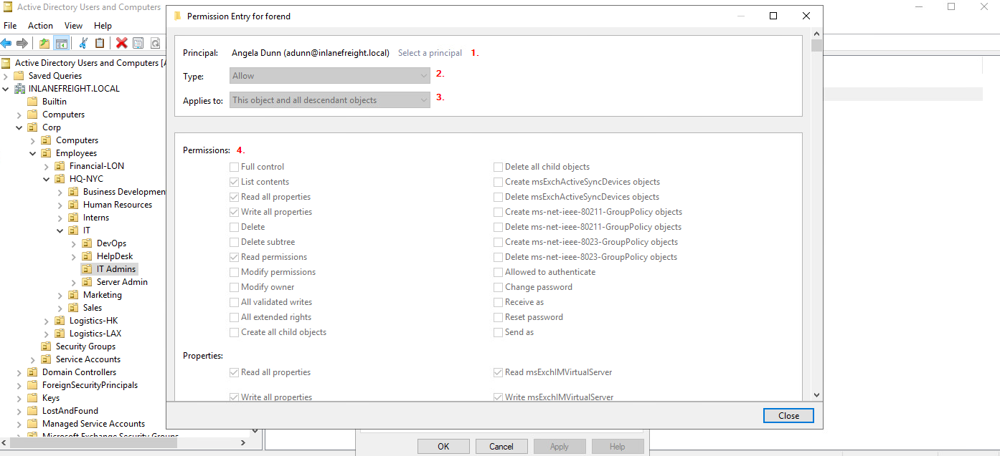
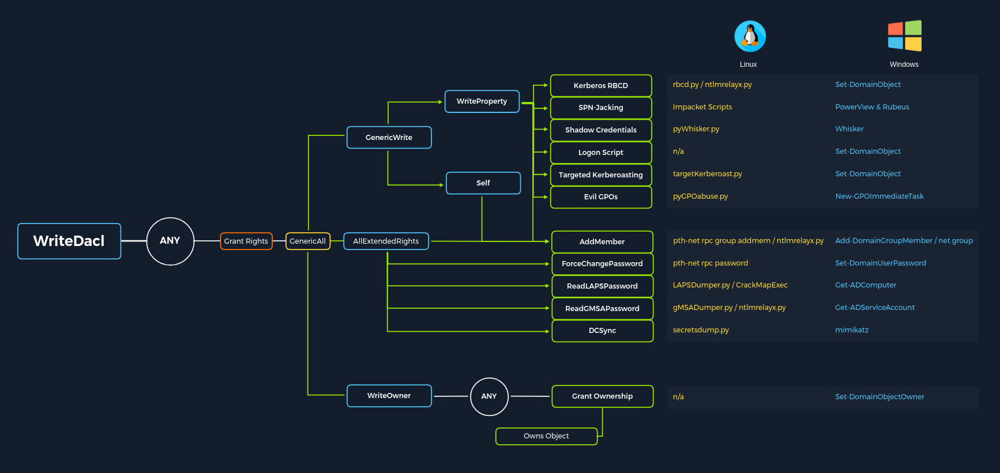
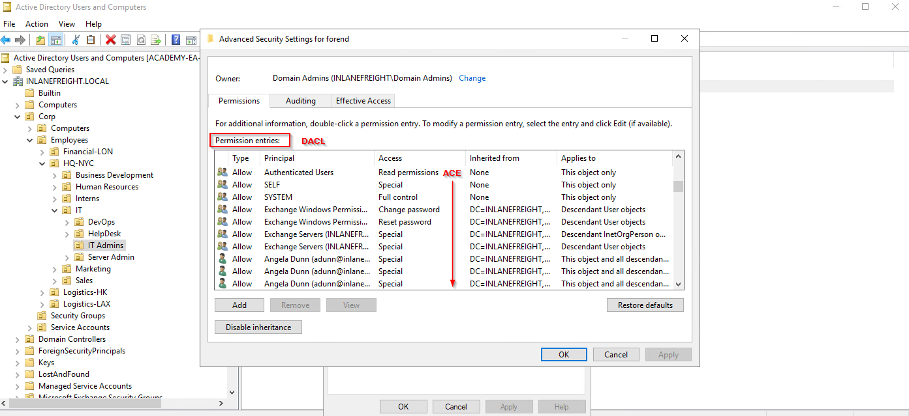
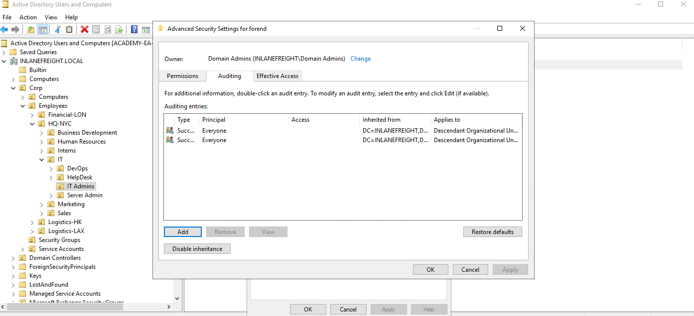

### Content
- [ACL Overview](#acl-overview)
- [Access Control Entries (ACEs)](#Access%20Control%20Entries%20(ACEs))
---
## ACL Overview

> [!Note]
> ACLs (Access Control List) are lists that define:
> - who has access to which asset/resource.
> - the level of access they are provisioned.
> 
> The settings themselves in an ACL are called Access Control Entries (ACEs).
> Each ACE maps back to a user, group, or process (also known as security principals) and defines the rights granted to that principal.
> Every object has an ACL, but can have multiple ACEs because multiple security principals can access objects in AD.

There are two types of ACLs:
1. `Discretionary Access Control List` (`DACL`) - defines which security principals are granted or denied access to an object. DACLs are made up of ACEs that either allow or deny access. When someone attempts to access an object, the system will check the DACL for the level of access that is permitted. If a DACL does not exist for an object, all who attempt to access the object are granted full rights. If a DACL exists, but does not have any ACE entries specifying specific security settings, the system will deny access to all users, groups, or processes attempting to access it.
2. `System Access Control Lists` (`SACL`) - allow administrators to log access attempts made to secured objects.

---
## Access Control Entries (ACEs)

There are `three` main types of ACEs:

|**ACE**|**Description**|
|---|---|
|`Access denied ACE`|Used within a DACL to show that a user or group is explicitly denied access to an object|
|`Access allowed ACE`|Used within a DACL to show that a user or group is explicitly granted access to an object|
|`System audit ACE`|Used within a SACL to generate audit logs when a user or group attempts to access an object. It records whether access was granted or not and what type of access occurred|

Each ACE is made up of the following `four` components:
1. The security identifier (SID) of the user/group that has access to the object (or principal name graphically)
2. A flag denoting the type of ACE (access denied, allowed, or system audit ACE)
3. A set of flags that specify whether or not child containers/objects can inherit the given ACE entry from the primary or parent object
4. An [access mask](https://docs.microsoft.com/en-us/openspecs/windows_protocols/ms-dtyp/7a53f60e-e730-4dfe-bbe9-b21b62eb790b?redirectedfrom=MSDN) which is a 32-bit value that defines the rights granted to an object



Some example AD object security permissions are as follows:
- [ForceChangePassword](https://bloodhound.readthedocs.io/en/latest/data-analysis/edges.html#forcechangepassword) - gives us the right to reset a user's password without first knowing their password.
- [GenericWrite](https://bloodhound.readthedocs.io/en/latest/data-analysis/edges.html#genericwrite) - gives us the right to write to any non-protected attribute on an object.
	- If we have this access over a user, we could assign them an SPN and perform a Kerberoasting attack. Over a group means we could add ourselves or another security principal to a given group.
	- If we have this access over a computer object, we could perform a resource-based constrained delegation attack.
- `AddSelf` - shows security groups that a user can add themselves to.
- [GenericAll](https://bloodhound.readthedocs.io/en/latest/data-analysis/edges.html#genericall) - this grants us full control over a target object.
	- Depending on if this is granted over a user or group, we could modify group membership, force change a password, or perform a targeted Kerberoasting attack.
	- If we have this access over a computer object and the [Local Administrator Password Solution (LAPS)](https://www.microsoft.com/en-us/download/details.aspx?id=46899) is in use in the environment, we can read the LAPS password and gain local admin access to the machine which may aid us in lateral movement or privilege escalation in the domain.

Possible ACE attacks and the tools to perform these attacks from both Windows and Linux (if applicable).



---

> Check a user ACL: `Open (Active directory users and computers) > click on (view) > check (Advanced Features) > choose a principal then right click and open (properties) > open (security) > click (Advanced)`
> 
> - The `Permissions` tab will be the ACL's tab.
> - The `Auditing` tab will be the SACL's tab. 





---
## ACL Enumeration

PowerView
``` PowerShell
# Extract every ACL in the domain, the output will be excessive 
PS C:\> 
```