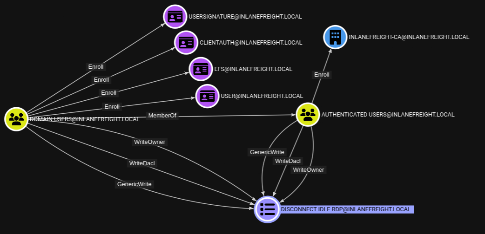
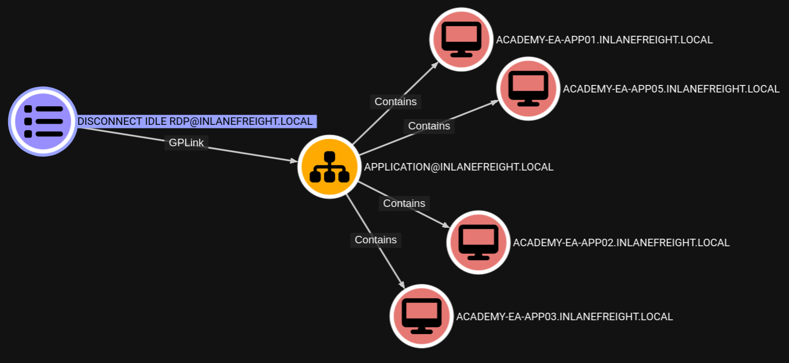

### Content
- [Exchange Related Group Membership](#exchange-related-group-membership)
- [PrivExchange](#privexchange)
- [Printer Bug](#printer-bug)
- [MS14-068](#ms14-068)
- [Sniffing LDAP Credentials](#sniffing-ldap-credentials)
- [Enumerating DNS Records](#enumerating-dns-records)
- [Password in Description Field](#password-in-description-field)
- [PASSWD_NOTREQD Field](#passwd_notreqd-field)
- [Credentials in SMB Shares and SYSVOL Scripts](#credentials-in-smb-shares-and-sysvol-scripts)
- [Group Policy Preferences (GPP) Passwords](#group-policy-preferences-(gpp)-passwords)
---
# Exchange Related Group Membership

- Microsoft Exchange is often granted considerable privileges within the domain (via users, groups, and ACLs).
- The group `Exchange Windows Permissions` is not listed as a protected group, but members are granted the ability to write a DACL to the domain object.
- This can be leveraged to give a user DCSync privileges.
- An attacker can add accounts to this group by leveraging a DACL misconfiguration (possible) or by leveraging a compromised account that is a member of the Account Operators group.
- It is common to find user accounts and even computers as members of this group.
- Power users and support staff in remote offices are often added to this group, allowing them to reset passwords.
- [Exchange-AD-Privesc](https://github.com/gdedrouas/Exchange-AD-Privesc/tree/master)details a few techniques for leveraging Exchange for escalating privileges in an AD environment.

The Exchange group `Organization Management` is another extremely powerful group (effectively the "Domain Admins" of Exchange) and can access the mailboxes of all domain users. It is not uncommon for sysadmins to be members of this group. This group also has full control of the OU called `Microsoft Exchange Security Groups`, which contains the group `Exchange Windows Permissions`.

---
# PrivExchange

- The `PrivExchange` attack results from a flaw in the Exchange Server `PushSubscription` feature, which allows any domain user with a mailbox to force the Exchange server to authenticate to any host provided by the client over HTTP.

The Exchange service runs as SYSTEM and is over-privileged by default (i.e., has WriteDacl privileges on the domain pre-2019 Cumulative Update). This flaw can be leveraged to relay to LDAP and dump the domain NTDS database. If we cannot relay to LDAP, this can be leveraged to relay and authenticate to other hosts within the domain. This attack will take you directly to Domain Admin with any authenticated domain user account.

[PrivExchange](https://github.com/dirkjanm/PrivExchange)

---
# Printer Bug

- The Printer Bug is a flaw in the MS-RPRN protocol (Print System Remote Protocol).
- This protocol defines the communication of print job processing and print system management between a client and a print server.
- To leverage this flaw, any domain user can connect to the spool's named pipe with the `RpcOpenPrinter` method and use the `RpcRemoteFindFirstPrinterChangeNotificationEx` method, and force the server to authenticate to any host provided by the client over SMB.

We can use tools such as the **`Get-SpoolStatus`** module from [NetNTLMtoSilverTicket](https://github.com/NotMedic/NetNTLMtoSilverTicket) or [Security-Assessment](https://web.archive.org/web/20200919080216/https://github.com/cube0x0/Security-Assessment) to check for machines vulnerable to the [MS-PRN Printer Bug](https://blog.sygnia.co/demystifying-the-print-nightmare-vulnerability). This flaw can be used to compromise a host in another forest that has Unconstrained Delegation enabled, such as a domain controller. It can help us to attack across forest trusts once we have compromised one forest.

---
# MS14-068

- This was a flaw in the Kerberos protocol, which could be leveraged along with standard domain user credentials to elevate privileges to Domain Admin.
- A Kerberos ticket contains information about a user, including the account name, ID, and group membership in the Privilege Attribute Certificate (PAC).
- The PAC is signed by the KDC using secret keys to validate that the PAC has not been tampered with after creation.
- The vulnerability allowed a forged PAC to be accepted by the KDC as legitimate.
- This can be leveraged to create a fake PAC, presenting a user as a member of the Domain Administrators or other privileged group.
- It can be exploited with tools such as the [Python Kerberos Exploitation Kit (PyKEK)](https://github.com/SecWiki/windows-kernel-exploits/tree/master/MS14-068/pykek) or the Impacket toolkit.

The only defense against this attack is patching.

---
# Sniffing LDAP Credentials

- Many applications and printers store LDAP credentials in their web admin console to connect to the domain.
- These consoles are often left with weak or default passwords.
- Sometimes, these credentials can be viewed in cleartext.
- Other times, the application has a `test connection` function that we can use to gather credentials by changing the LDAP IP address to that of our attack host and setting up a `netcat` listener on LDAP port 389.

When the device attempts to test the LDAP connection, it will send the credentials to our machine, often in cleartext. Accounts used for LDAP connections are often privileged, but if not, this could serve as an initial foothold in the domain. Other times, a full LDAP server is required to pull off this attack, as detailed in this [post](https://grimhacker.com/2018/03/09/just-a-printer/).

---
# Enumerating DNS Records

- We can use a tool such as [adidnsdump](https://github.com/dirkjanm/adidnsdump) to enumerate all DNS records in a domain using a valid domain user account.
- If the naming convention from `BloodHound` enumeration is similar to `SRV00001.company.local`, which is non-descriptive name.
- If we can access DNS entries in AD, we can potentially discover interesting DNS records that point to this same server, such as `gitlab.company.local`, which we can use to better plan out our attacks.

The tool works because, by default, all users can list the child objects of a DNS zone in an AD environment. By default, querying DNS records using LDAP does not return all results. So by using the `adidnsdump` tool, we can resolve all records in the zone and potentially find something useful for our engagement. The background and more in-depth explanation of this tool and technique can be found in this [post](https://dirkjanm.io/getting-in-the-zone-dumping-active-directory-dns-with-adidnsdump/).


```bash
$ adidnsdump -u inlanefreight\\forend ldap://172.16.5.5 -r
$ head records.csv 

type,name,value
```

---
# Password in Description Field

Sensitive information such as account passwords are sometimes found in the user account `Description` or `Notes` fields and can be quickly enumerated using `PowerView`.

```powershell
Get-DomainUser * | Select-Object samaccountname,description |Where-Object {$_.Description -ne $null}
```

---
# PASSWD_NOTREQD Field

- If [passwd_notreqd](https://ldapwiki.com/wiki/Wiki.jsp?page=PASSWD_NOTREQD) userAccountControl Attribute Value bit is set, the user is not subject to the existing password policy length.
- The user could have shorter password or no password at all.

Checking for PASSWD_NOTREQD Setting using `PowerView`

```Powershell
Get-DomainUser -UACFilter PASSWD_NOTREQD | Select-Object samaccountname,useraccountcontrol
```

---
# Credentials in SMB Shares and SYSVOL Scripts

```powershell
PS C:\> ls \\domain-dc01\SYSVOL\
```
---
# Group Policy Preferences (GPP) Passwords

> [!Important]
> it is worth attempting to password spray internally with this password (especially if it is unique). Password re-use is widespread, and the GPP password combined with password spraying could result in further access.

- When a new GPP is created, an .xml file is created in the SYSVOL share, also cached locally on endpoints that the Group Policy applies to.
- These files can include those used to:
	- Map drives (drives.xml)
	- Create local users
	- Create printer config files (printers.xml)
	- Creating and updating services (services.xml)
	- Creating scheduled tasks (scheduledtasks.xml)
	- Changing local admin passwords.
- These files can contain an array of configuration data and defined passwords.
- The `cpassword` attribute value is AES-256 bit encrypted with Microsoft [published the AES private key on MSDN](https://docs.microsoft.com/en-us/openspecs/windows_protocols/ms-gppref/2c15cbf0-f086-4c74-8b70-1f2fa45dd4be?redirectedfrom=MSDN).
- Any domain user can read these files as they are stored on the SYSVOL share, and all authenticated users in a domain, by default, have read access to this domain controller share.

The XML looks like the following:

``` xml
<Groups clsid="{}">
	<User clsid="{}" name="Administrator" image="2" changed="2019-01" policyApplied="1">
	<Properties cpassword="CiDUq6tbrBL1m/js9DmZNIydXps" neverExpires="1" acctDisabled="0" userName="Administrator"/>
	</User>
</Groups>
```

#### Decrypted cpassword with gpp-decrypt

```bash
$ gpp-decrypt VPe/o9YRyz2cksnYRbNeQj35w9KxQ5ttbvtRaAVqxaE
```

GPP passwords can be located by searching or manually browsing the SYSVOL share or using tools such as [Get-GPPPassword.ps1](https://github.com/PowerShellMafia/PowerSploit/blob/master/Exfiltration/Get-GPPPassword.ps1), the GPP Metasploit Post Module, and other Python/Ruby scripts which will locate the GPP and return the decrypted cpassword value. CrackMapExec also has two modules for locating and retrieving GPP passwords.

- It is also possible to find passwords in files such as Registry.xml when autologon is configured via Group Policy.
- This may be set up for any number of reasons for a machine to automatically log in at boot.
- If this is set via Group Policy and not locally on the host, anyone on the domain can retrieve credentials stored in the Registry.xml.
- We can hunt for this using CrackMapExec with the [gpp_autologin](https://www.infosecmatter.com/crackmapexec-module-library/?cmem=smb-gpp_autologin) module, or using the [Get-GPPAutologon.ps1](https://github.com/PowerShellMafia/PowerSploit/blob/master/Exfiltration/Get-GPPAutologon.ps1) script included in PowerSploit.

#### Locating & Retrieving GPP Passwords with CrackMapExec

```bash 
$ crackmapexec smb -L | grep gpp

[*] gpp_autologin
[*] gpp_password 

$ crackmapexec smb 172.16.5.5 -u forend -p Klmcargo2 -M gpp_autologin

GPP_AUTO... 172.16.5.5 445 DC01  [*] Found domain.LOCAL/Policies/{CA...}/Machine/Preferences/Registry/Registry.xml
GPP_AUTO... 172.16.5.5 445 DC01  Usernames: ['guarddesk']
GPP_AUTO... 172.16.5.5 445 DC01  Domains: ['Domain.LOCAL']
GPP_AUTO... 172.16.5.5 445 DC01  Passwords: ['ILFreightguardadmin!']
```

> This was patched in 2014 [MS14-025 Vulnerability in GPP could allow elevation of privilege](https://support.microsoft.com/en-us/topic/ms14-025-vulnerability-in-group-policy-preferences-could-allow-elevation-of-privilege-may-13-2014-60734e15-af79-26ca-ea53-8cd617073c30), to prevent administrators from setting passwords using GPP. The patch does not remove existing Groups.xml files with passwords from SYSVOL. If you delete the GPP policy instead of unlinking it from the OU, the cached copy on the local computer remains.

---
# Group Policy Object (GPO) Abuse

- Group Policy provides administrators with many advanced settings that can be applied to both user and computer objects in an AD environment.
- If we can gain rights over a Group Policy Object via an ACL misconfiguration, we could leverage this for lateral movement, privilege escalation, and even domain compromise and as a persistence mechanism within the domain.
- We can enumerate GPO information using `PowerView`, `BloodHound`, [group3r](https://github.com/Group3r/Group3r), [ADRecon](https://github.com/sense-of-security/ADRecon), [PingCastle](https://www.pingcastle.com/).

GPO misconfigurations can be abused to perform:
- Adding additional rights to a user (such as `SeDebugPrivilege`, `SeTakeOwnershipPrivilege`, or `SeImpersonatePrivilege`)
- Adding a local admin user to one or more hosts
- Creating an immediate scheduled task to perform any number of actions
#### Enumerating GPO

```Powershell
# PowerView
PS C:\> Get-DomainGPO | select displayname
# Built-in cmdlet
PS C:\> Get-GPO -All | Select DisplayName

# PowerView
# Check if a user we can control has any rights over a GPO.
# A good first check is to see if the entire Domain Users group has any rights over one or more GPOs.
PS C:\> $sid=Convert-NameToSid "Domain Users"
PS C:\> Get-DomainGPO | Get-ObjectAcl | ?{$_.SecurityIdentifier -eq $sid}

# Use the GPO GUID combined with Get-GPO to see the display name of the GPO.
PS C:\> Get-GPO -Guid 7CA9C789-14CE-46E3-A722-83F4097AF532
```

We could use a tool such as [SharpGPOAbuse](https://github.com/FSecureLABS/SharpGPOAbuse) to take advantage of this GPO misconfiguration.

We can also see that in BloodHound


If we select the GPO in BloodHound and scroll down to `Affected Objects` on the `Node Info` tab, we can see that this GPO is applied to one OU, which contains four computer objects.



